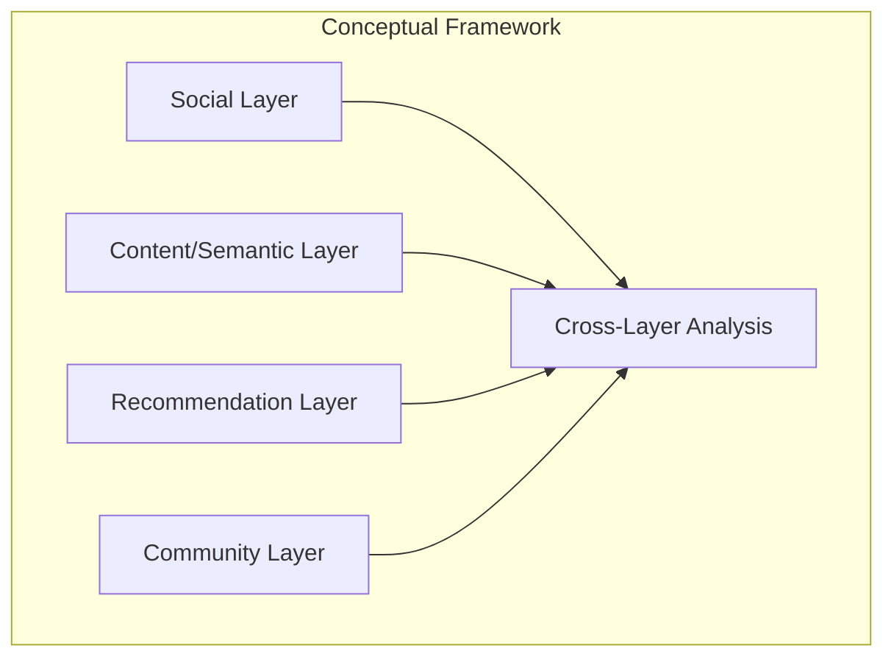
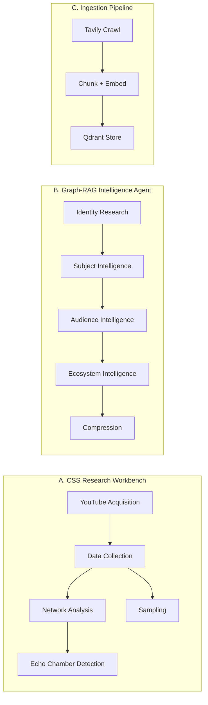
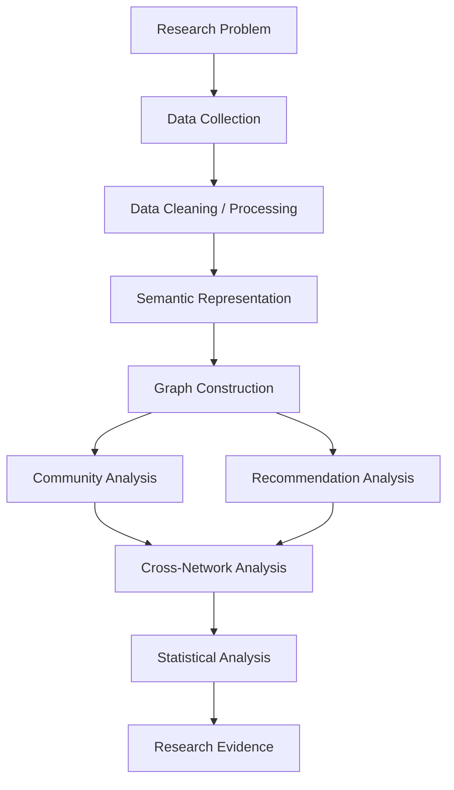
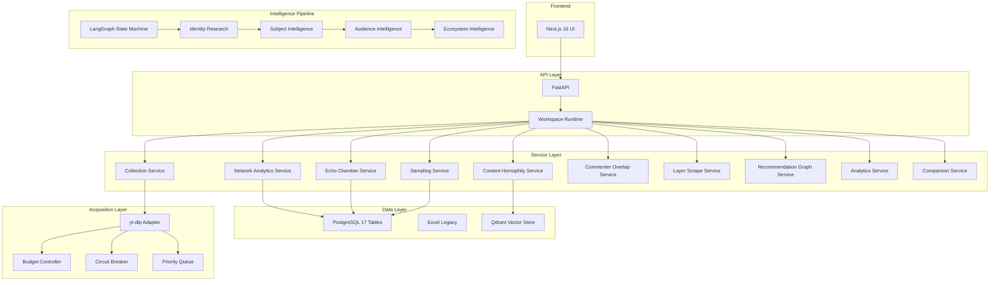
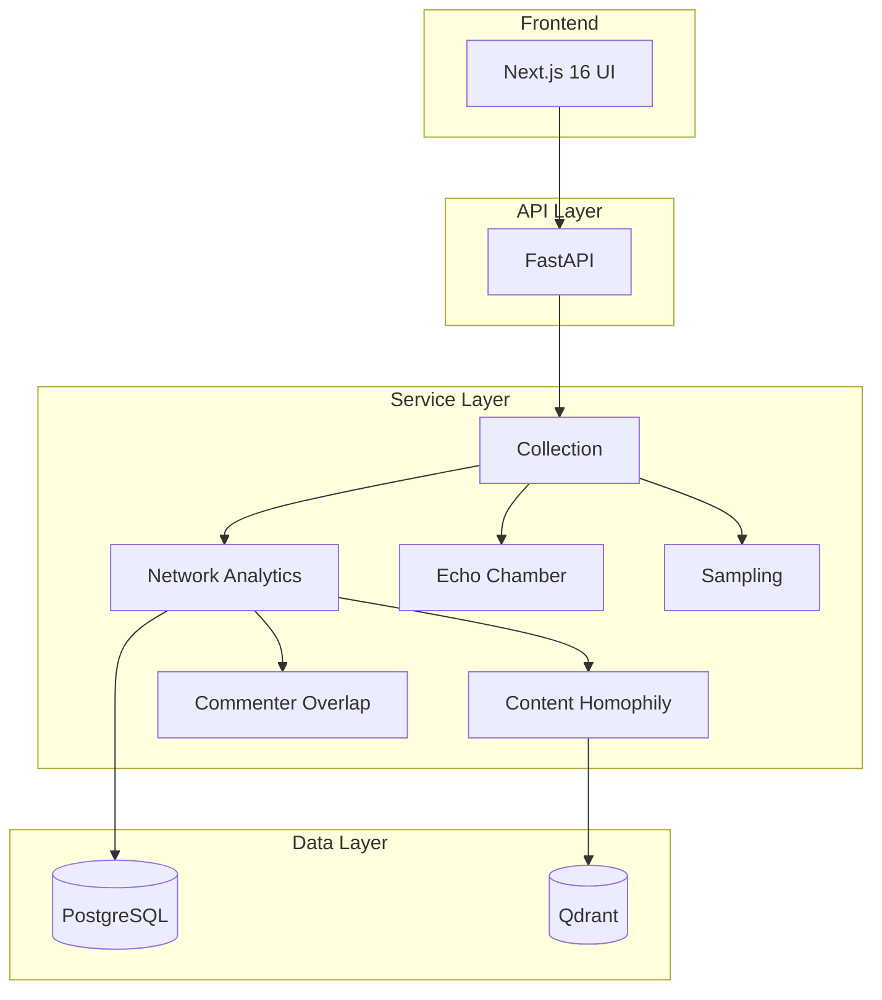
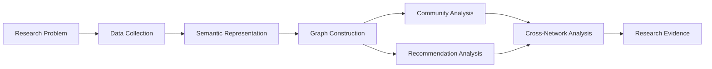

# The CSocial Science Lab — Computational Social Science Research Platform

> A research-engineering artifact for investigating platform-mediated information environments through joint analysis of social interaction, content semantics, recommendation structures, and community dynamics on YouTube.


---

## Key Achievements

### Performance
- **Video enrichment: 33s → 2.8s (~12x faster)** — YouTube `/next` API bypass
- **collect/recommendations endpoint: 90s+ timeout → 38s** — stub-based enrichment
- **Multi-layer crawling**: 2+ layers, 6,500+ videos, 0 failures, 0 rate-limit blocks in 1 hour
- **Advanced rate limiting**: AIMD BudgetController (self-tuning throttle), CircuitBreaker, YtdlContextLimiter, PriorityTaskQueue, speed presets (fast/balanced/careful)

### Transcript Retrieval
- **Configured transcript service**: Routes transcript fetching to FreeTranscriptAPI (when configured) instead of yt-dlp — **10x faster** transcript retrieval, no PO Token required
- **Routing provider**: `RoutingAcquisitionProvider` selects the optimal transcript backend based on runtime config

### Reliability
- **939/939 unit tests passing** + 71/71 E2E tests
- **Auto-reconcile stuck runs** at boot (SQL `reconcile_stale_running`)
- **Job pause/resume**: stop long crawls, wait for rate limits, resume later
- **UTF-8 / cp1252 crash fix**: non-Latin titles no longer crash the pipeline

### Echo Chamber Analysis
- **Configurable top-N recommendations**: save resources by scraping only top 5-10 per video (was hardcoded ~20)
- **Channel network projection**: 100% weakly connected components, 9.3% reciprocity, 11.8% global clustering
- **Unattributed edge reduction**: 95% of edges survive channel projection (up from 54%)

### GPT-Researcher Integration
- **Customized fork** of [assafelovic/gpt-researcher](https://github.com/assafelovic/gpt-researcher) — tailored for this project's needs
- **Customized system prompts**: every agent prompt rewritten for domain-specific use cases (audience intelligence, subject analysis, ecosystem mapping)
- **Key customizations**: embedding rate limiting, MCP tool selection improvements, context compression hardening, `.env` bootstrapping
- **Not a divergent rewrite** — surgical additions to upstream codebase (15 files, 1028 insertions)

### Research Capabilities
- **Reproducible sampling**: every sample records strategy, seed, strata, date range
- **Read-only analytics**: no fabrications, every metric carries explicit availability flag
- **Full provenance**: provider, version, config snapshot, per-entity errors per run

---

## Executive Summary

Contemporary platforms simultaneously function as social environments, content-distribution systems, recommendation engines, and information landscapes. Users encounter these layered mechanisms not in isolation but as interleaved forces that shape exposure, community formation, and information access. Studying these phenomena requires computational infrastructure capable of representing and comparing multiple analytical perspectives on the same information ecosystem.

This project implements such infrastructure. It provides a computational social-science research workbench that constructs and jointly examines three network representations of YouTube data: a social interaction network derived from commenter co-participation, a semantic content network derived from transcript embeddings, and a platform-mediated recommendation network derived from observable recommendation pathways. The system integrates these representations within a single computational environment, enabling cross-network comparison, community interaction analysis, and echo-chamber detection through five observable signals.

Critically, the collection infrastructure supports **context-aware data acquisition**: researchers can collect recommendations using controlled account/session cookies, browser impersonation, proxy-based network positioning, and configurable scraping contexts. This means the same content can be observed under different user or geographic contexts—enabling comparative analysis of recommendation environments rather than relying on blind, context-free scraping. A recommendation network collected from an anonymous session differs from one collected through a logged-in account; the system makes both observable and comparable.

The project consists of three cooperating systems: a CSS Research Workbench (`SocialScienceResearch/`) providing YouTube data collection, network analysis, echo-chamber detection, and export across 160 API endpoints; a Graph-RAG Intelligence Agent (`RetrievalPipeline/`) implementing a LangGraph state machine for multi-layer identity, audience, and ecosystem analysis; and an Ingestion Pipeline (`Ingestion_Pipline/`) for document processing, embedding, and vector-store operations. Together these systems operationalize theoretical concepts from computational social science into reproducible computational procedures, while maintaining clear distinctions between observed structure, interpretation, and causal inference.

---

## Why This Project Exists

The study of online information environments has become central to understanding how platforms shape user experience, community formation, and information access. Phenomena such as polarization, echo chambers, information fragmentation, community isolation, and recommendation-mediated exposure are widely discussed in both academic research and public discourse. However, investigating these phenomena computationally is methodologically challenging.

A social network alone reveals who interacts with whom but not what content is being discussed. A semantic network reveals which content is related but not who is interacting around that content. A recommendation network reveals which videos the platform connects through algorithmic pathways but not whether users actually consume those recommendations. Each representation captures a different facet of the same underlying information environment, and no single network can fully characterize the complex interplay between users, content, communities, and platform mechanisms.

This project was built to address that gap. It provides computational infrastructure for constructing, analyzing, and comparing multiple network representations of the same platform ecosystem, enabling researchers to examine how social structures, content relationships, and recommendation pathways correspond to or diverge from one another.

---

## Problem Statement

Contemporary digital platforms are simultaneously:

- **Social environments** where users interact through comments, replies, and engagement
- **Content-distribution environments** where creators publish and audiences consume
- **Recommendation environments** where algorithmic systems connect content and suggest pathways
- **Information environments** where all of these mechanisms shape what users encounter

Users do not experience these systems through a single mechanism. A user on YouTube encounters:

```
Users
  ↓
Social interactions (comments, replies, engagement)
  ↓
Content (videos, transcripts, topics)
  ↓
Content communities (channels, topic clusters)
  ↓
Algorithmic recommendations (related videos, Up Next)
  ↓
Repeated or diversified exposure
  ↓
Community boundaries and cross-community pathways
```

These mechanisms interact in ways that are difficult to study using a single dataset or network representation. A researcher examining only social interactions may miss how recommendation pathways connect otherwise separate communities. A researcher examining only recommendation structures may miss how content semantics cluster differently from platform-mediated connections. A researcher examining only content similarity may miss how social interaction patterns create structural boundaries.

The methodological challenge is that each analytical perspective reveals different aspects of the same information environment, and the relationships between these perspectives are themselves objects of study.

---

## Research Challenge

Conventional analysis of platform-mediated information environments is insufficient because each individual network representation captures only a partial view:

| Network Type | Reveals | Cannot By Itself Reveal |
|---|---|---|
| Social network | Who interacts with whom | What content is being discussed |
| Semantic/content network | Which content is related | Who is interacting around that content |
| Recommendation network | Which videos the platform connects | Whether users consume those recommendations |

A social network can tell us:

> Who interacts with whom?

But it cannot by itself tell us:

> What is the content being discussed, and are the interacting users consuming similar or divergent information?

A semantic/content network can tell us:

> Which content is related based on transcript similarity?

But not necessarily:

> Who is interacting around that content, and does the platform recommend content across semantic boundaries?

A recommendation network can tell us:

> Which videos the platform connects through recommendation edges?

But not:

> Whether those recommendations bridge or reinforce existing community structures.

Therefore, investigating platform-mediated information environments requires integrating multiple representations of the same ecosystem. This project provides the computational infrastructure to construct, analyze, and compare these representations jointly.

---

## Why YouTube?

YouTube is a particularly meaningful research environment for studying platform-mediated information environments for several reasons:

**Large-scale user-generated content.** YouTube hosts millions of creators producing diverse content across topics, perspectives, and communities. This diversity makes it possible to observe how content clusters, separates, and intersects.

**Social interaction through comments.** YouTube comments provide observable social interaction data. Co-commenting patterns—who comments on the same videos—reveal audience overlap and community structure that may not be visible from content alone.

**Content communities.** Channels and topics form identifiable content communities. These communities can be analyzed structurally (through interaction patterns), semantically (through transcript content), and through platform mechanisms (through recommendation pathways).

**Algorithmically mediated recommendations.** YouTube's recommendation system creates directed pathways between content. These pathways are partially observable and can be systematically collected, providing a computational representation of platform-mediated content connections.

**Observable recommendation pathways.** Unlike many platform mechanisms, YouTube's "Up Next" and related video recommendations can be observed and recorded, enabling the construction of recommendation networks with explicit edge direction and rank.

**Heterogeneous audiences.** Different content communities attract different audience segments. Analyzing commenter overlap across communities reveals how audiences are distributed and whether bridging users exist.

**Interaction between platform mechanisms and user behavior.** YouTube's recommendation system, content communities, and social interactions are not independent—they shape each other. This interplay makes YouTube a rich environment for studying how platform mechanisms interact with user behavior.

The project treats YouTube as a **research environment** for studying platform-mediated information phenomena, not merely as a data source to be scraped.

---

## Research Motivation

This project is motivated by the methodological gap between the complexity of platform-mediated information environments and the analytical capabilities of single-network research approaches.

Computational social science has developed powerful tools for analyzing individual network types: social network analysis for interaction data, natural language processing for content analysis, and recommendation-system analysis for platform mechanisms. However, these tools are typically applied in isolation, each producing a partial view of the information environment.

The research motivation is to create infrastructure that enables **joint examination** of:

- **Social structure** — how users organize into interaction-based communities
- **Semantic/content structure** — how content clusters based on topic and meaning
- **Recommendation structure** — how the platform connects content through algorithmic pathways
- **Community structure** — how communities emerge from and are bounded by these different mechanisms

By constructing and comparing these representations within a single computational environment, researchers can investigate questions that no single representation can answer alone:

- Do social communities correspond to semantic communities?
- Do recommendation pathways cross community boundaries?
- Are socially separated communities connected through recommendation pathways?
- Where do social, semantic, and recommendation structures diverge?

The emphasis is on creating **research infrastructure** that enables empirical investigation, not on claiming specific findings about YouTube or any particular content domain.

---

## Conceptual Framework

The project operates through multiple interacting analytical layers, each capturing a different dimension of the YouTube information environment:

### Social Layer

**Question:** Who interacts with whom?

The social layer represents user interaction through co-commenting patterns. When multiple users comment on the same video, they form an indirect interaction tie. This creates a commenter co-comment network where edges represent shared participation in comment sections.

**Implementation:** Commenter overlap analysis with Jaccard similarity, overlap coefficient, and bridge-commenter detection (`services/commenter_overlap_service.py`). Co-commenter network construction with multiple projections (`services/commenter_network_service.py`).

### Content/Semantic Layer

**Question:** What content is related to what?

The content layer represents relationships between videos based on their semantic characteristics. Video transcripts are embedded into vector representations, and semantic similarity between videos is computed. This reveals content communities—groups of videos that are semantically similar regardless of whether they share audiences or recommendation pathways.

**Implementation:** Transcript collection, embedding pipeline, within/between-community pair sampling, permutation null testing (`services/content_homophily_service.py`).

### Recommendation Layer

**Question:** Which content does the platform connect?

The recommendation layer represents directed recommendation relationships between videos. These are observed through systematic collection of "Up Next" and related video recommendations, creating a directed graph where edges represent platform-mediated content connections.

**Implementation:** Three-layer fallback extraction (yt-dlp, yt-search-python, page-dump parser) (`acquisition/yt_dlp_adapter.py`), recommendation DiGraph construction with PageRank (`services/recommendation_graph_service.py`), layered BFS crawling (`services/layer_scrape_service.py`).

### Community Layer

**Question:** Which users/content belong to coherent communities?

The community layer identifies groups of nodes that are densely connected within themselves and sparsely connected to other groups. Communities can emerge from social interaction patterns, content similarity, or recommendation structure, and these community boundaries are themselves objects of analysis.

**Implementation:** Louvain community detection with seed=42, modularity computation, within-community rate, conductance analysis (`services/network_analytics_service.py`, `services/structural_metrics.py`).

### Cross-Layer Relationships

**Question:** How do social, semantic, and recommendation structures correspond to or diverge from one another?

The cross-layer analysis compares the different network representations to identify:

- **Overlap** — where social, semantic, and recommendation structures align
- **Divergence** — where they differ, revealing potential information-environment asymmetries
- **Bridges** — nodes or edges that connect otherwise separate communities across layers
- **Isolation** — communities that are separated in one layer but connected in another

**Implementation:** Comparative network analysis, community interaction matrices, network merge operations (`services/network_analytics_service.py`, `services/network_matrix_service.py`).



---

## Polarization, Echo Chambers, and Information Fragmentation

This project provides computational infrastructure for investigating phenomena related to polarization, echo chambers, and information fragmentation. It is essential to discuss these concepts with analytical precision and without unsupported causal claims.

### Community ≠ Echo Chamber

A community detected through structural or semantic analysis represents cohesion—groups of nodes that are densely connected or semantically similar. This cohesion does not, by itself, constitute an echo chamber. An echo chamber implies a specific informational dynamic: reduced exposure to diverse perspectives, reinforcement of existing views, and isolation from alternative information. The project detects structural patterns that may be consistent with echo-chamber-like dynamics, but structural cohesion alone is not evidence of an echo chamber.

### Similarity ≠ Polarization

Semantic similarity between content—measured through transcript embeddings—indicates topical or thematic relatedness. This does not establish ideological polarization. Two videos may be semantically similar (discussing the same topic) without exhibiting the attitudinal divergence that characterizes polarization. The project measures semantic similarity as an observable proxy, not as a direct measure of ideological distance.

### Recommendation ≠ Causal Influence

An observed recommendation edge—a platform-mediated connection between two videos—does not demonstrate that a user watched, accepted, or was influenced by the recommended content. Recommendation edges represent observable platform behavior, not user behavior or cognitive effects. The project collects and analyzes recommendation structures as observable data, not as evidence of influence.

### Network Separation ≠ Psychological Isolation

Structural separation between communities—measured through network metrics such as low inter-community edge density—does not automatically prove psychological or attitudinal isolation. Users may access content across structural boundaries through means not captured in the network representation (e.g., external links, search, social media). The project measures structural separation as an observable property of the network, not as a direct measure of psychological state.

### Observable Proxies for Investigation

The project's computational structures provide observable proxies and analytical evidence for investigating these phenomena:

- **Frontier collapse ratio** (S1) — measures whether recommendation expansion narrows over layers
- **Seed-community concentration** (S2) — measures whether recommendations cluster around the seed community
- **Top-channel share** (S3) — measures concentration of recommendation edges in a few channels
- **Cross-layer repetition** (S4) — measures whether the same channels appear across recommendation layers
- **Commenter-overlap reinforcement** (S5) — measures whether commenters within recommendations are from the same community

These signals are computed from observed data and wrapped with explicit status indicators (`available | unavailable`), maintaining honest reporting of what can and cannot be inferred.

---

## User Information Environment

The project can be understood from the perspective of a user navigating the YouTube platform. The important question is:

> What kind of information environment can a user encounter within a platform where social interaction, content communities, and algorithmic recommendations interact?

The system enables analysis of:

- **Repeated exposure** — Whether a user's recommendation pathway leads to content from the same community, measured through cross-layer repetition (S4) and community concentration (S2)
- **Community reinforcement** — Whether social interaction (commenting) and recommendation structures overlap, measured through commenter-overlap reinforcement (S5)
- **Movement between content communities** — Whether recommendation pathways cross community boundaries, measured through cross-community recommendation edges
- **Cross-community exposure** — Whether users who comment across communities also encounter cross-community recommendations
- **Recommendation pathways** — The directed paths through which the platform connects content, observable through layered crawling
- **Potential information isolation** — Structural communities with low inter-community connectivity, measured through community metrics (conductance, within-community rate)
- **Community boundaries** — The structural and semantic edges that define community membership
- **Bridging content** — Videos or users that connect otherwise separate communities

The system can **observe** structural patterns in social interaction, content similarity, and recommendation pathways. It cannot, from observational data alone, determine whether a user experienced repeated exposure, felt psychologically isolated, or was influenced by recommendations. Behavioral or experimental evidence would be required for such claims. The project provides the structural and relational data that could inform such studies.

---

## Methodological Gap

Studying platform-mediated information environments through only one network can obscure important relationships that emerge only at the intersection of multiple analytical perspectives.

A researcher studying only the social network might observe that two communities are structurally separate. But this observation alone cannot reveal whether the platform's recommendation system connects these communities, or whether the content discussed in each community is semantically similar despite social separation.

A researcher studying only the recommendation network might observe that recommendations cross community boundaries. But this observation alone cannot reveal whether users in those communities actually engage with the cross-recommended content, or whether social interaction patterns reinforce or resist the recommendation structure.

The project therefore provides a computational framework capable of jointly examining:

- **Social structure** — derived from commenter co-participation
- **Semantic/content structure** — derived from transcript embeddings
- **Recommendation structure** — derived from observable platform recommendations
- **Community structure** — derived from each of the above, enabling cross-layer community comparison

This joint examination is the methodological rationale for the system. It does not claim to be the first system to integrate multiple network perspectives, but it provides a concrete, reproducible implementation of this approach applied to YouTube data.

---

## Research Objectives

The project objectives are derived from the actual implementation:

1. **Construct computational representations of user interaction** through commenter co-comment networks with Jaccard similarity, overlap coefficients, and bridge-commenter detection.

2. **Represent content through semantic methods** using transcript collection, embedding generation, and cosine similarity measurement between videos.

3. **Identify and analyze content communities** through Louvain community detection, modularity computation, within-community rate, and conductance analysis.

4. **Collect and model directed recommendation relationships** through multi-source extraction with three-layer fallback and directed graph construction.

5. **Analyze the expansion of recommendation networks** through breadth-first layered crawling with frontier management and snapshot classification.

6. **Compare social, semantic, and recommendation structures** through cross-network analysis, community interaction matrices, and network merge operations.

7. **Examine interactions between communities** through inter-community edge analysis, bridge-node detection, and community-level connectivity metrics.

8. **Detect echo-chamber-like structural patterns** through five observable signals with permutation null testing and composite scoring.

9. **Provide reproducible computational infrastructure** with deterministic seeds, provenance tracking, and explicit data-availability reporting for further empirical investigation.

---

## Research Questions

### Social Structure

- How are users organized into interaction-based communities?
- What structural characteristics distinguish these communities (density, reciprocity, clustering)?
- Which users act as bridges between communities?

### Content Structure

- What semantic communities emerge from the content based on transcript similarity?
- How does semantic similarity vary between communities?
- Is content within communities more semantically similar than content between communities?

### Recommendation Structure

- How does the recommendation network expand from an initial seed across successive layers?
- Which nodes or communities act as bridges in the recommendation network?
- How are recommendation pathways distributed across communities?

### Cross-Network Structure

- Do social communities correspond to semantic communities?
- Do recommendation pathways cross semantic or social community boundaries?
- Are socially separated communities connected through recommendation pathways?
- Where do social, semantic, and recommendation structures diverge?

### Information Environment

- Can the joint analysis of social, semantic, and recommendation layers provide stronger evidence for studying echo-chamber-like or fragmented information environments than any single representation?

**Important distinction:** These are research questions **enabled by the platform**. They are not claims about findings. The system provides the computational infrastructure to investigate these questions; answering them requires empirical analysis using collected data.

---

## Research Methodology

The project operationalizes abstract research concepts into computational procedures. For each analytical component:

### Social Network Construction

| Aspect | Description |
|---|---|
| **Input** | Collected comments with author identifiers and video associations |
| **Operationalization** | Social interaction → co-comment participation (two authors commenting on the same video) |
| **Representation** | Weighted undirected graph; nodes = commenters, edges = co-comment frequency |
| **Computation** | Jaccard similarity, overlap coefficient; NetworkX graph construction |
| **Output** | Commenter co-comment network with weighted edges |
| **Interpretation** | Structural proximity indicates shared audience participation |
| **Limitations** | Co-commenting is an indirect measure of social interaction; does not capture reply relationships or interaction quality |

### Semantic Content Analysis

| Aspect | Description |
|---|---|
| **Input** | Video transcripts (collected or extracted) |
| **Operationalization** | Content similarity → transcript embedding cosine similarity |
| **Representation** | Vector embeddings per video; pairwise similarity matrix |
| **Computation** | Text splitting, embedding generation, cosine similarity, within/between-community pair sampling |
| **Output** | Semantic similarity scores, permutation null test results (z-score, p-value) |
| **Interpretation** | High within-community similarity relative to between-community similarity indicates semantic clustering |
| **Limitations** | Embedding quality depends on the chosen model; transcript availability varies; similarity is topical, not ideological |

### Recommendation Network Collection

| Aspect | Description |
|---|---|
| **Input** | Seed video URLs |
| **Operationalization** | Platform recommendation → observable "Up Next" / related video edges |
| **Representation** | Directed graph; nodes = videos, edges = source → recommended-video with rank |
| **Computation** | Three-layer fallback extraction (yt-dlp, yt-search-python, page-dump parser); BFS layered expansion |
| **Output** | Directed recommendation graph with per-layer provenance |
| **Interpretation** | Directed edges represent observed platform-mediated content connections |
| **Limitations** | Recommendations are personalized and time-varying; collection captures a snapshot, not longitudinal behavior |

### Echo Chamber Detection

| Aspect | Description |
|---|---|
| **Input** | Recommendation network with community structure |
| **Operationalization** | Echo-chamber dynamics → five observable structural signals (S1-S5) |
| **Representation** | Per-signal scores with status indicators; composite score with verdict bands |
| **Computation** | Frontier collapse (S1), seed-community concentration (S2), top-channel share (S3), cross-layer repetition (S4), commenter-overlap reinforcement (S5); weighted composite |
| **Output** | Echo-chamber detection with per-layer timeline, structural metrics, and composite score |
| **Interpretation** | Signals indicate structural patterns consistent with echo-chamber-like dynamics; not proof of echo chambers |
| **Limitations** | Structural signals cannot establish cognitive or attitudinal effects; personalized recommendations may differ from collected data |

### Content Homophily Analysis

| Aspect | Description |
|---|---|
| **Input** | Videos with transcripts and community labels |
| **Operationalization** | Content homophily → semantic similarity within vs. between communities |
| **Representation** | Pairwise similarity scores with community membership |
| **Computation** | Seeded pair sampling, embedding-based cosine similarity, permutation null test (label shuffling), z-score and p-value |
| **Output** | Within-community and between-community similarity distributions, statistical significance |
| **Interpretation** | Significantly higher within-community similarity indicates content homophily |
| **Limitations** | Depends on transcript availability and embedding quality; permutation test assumes exchangeability |

### Commenter Overlap Analysis

| Aspect | Description |
|---|---|
| **Input** | Comments with author and video associations |
| **Operationalization** | Audience overlap → shared commenters between videos/channels |
| **Representation** | Pairwise overlap metrics (Jaccard, overlap coefficient, intersection) |
| **Computation** | Chunked streaming scan, identity resolution (author_id first, author_name fallback), memoization |
| **Output** | Overlap scores, bridge-commenter identification, co-commenter network |
| **Interpretation** | High overlap indicates shared audience; bridge commenters span multiple communities |
| **Limitations** | Commenting is voluntary and may not represent full audience; identity resolution depends on name consistency |

---

## Operationalization of Concepts

The following table maps theoretical research concepts to their computational representations in this system:

| Research Concept | Computational Representation | Implementation |
|---|---|---|
| Social interaction | Commenter co-comment network | `services/commenter_network_service.py` |
| Content similarity | Transcript embedding cosine similarity | `services/content_homophily_service.py` |
| Content community | Louvain community on semantic/content graph | `services/network_analytics_service.py` |
| Recommendation relationship | Directed source → recommended-video edge | `services/recommendation_graph_service.py` |
| Recommendation expansion | BFS layered crawl with frontier management | `services/layer_scrape_service.py` |
| Community connectivity | Cross-community edge density, conductance | `services/structural_metrics.py` |
| Information fragmentation | Structural/semantic separation measures | Community metrics (WCR, modularity) |
| Recommendation exposure | Observable recommendation pathways | `services/recommendation_graph_service.py` |
| Echo-chamber dynamics | Five observable signals (S1-S5) | `services/echo_chamber_service.py` |
| Audience overlap | Jaccard/overlap coefficient on commenters | `services/commenter_overlap_service.py` |
| Bridge users | Commenters active across ≥2 communities | `services/commenter_overlap_service.py` |
| Semantic homophily | Within vs. between community similarity | `services/content_homophily_service.py` |

---

## System Overview

The repository contains three cooperating systems within a single codebase:



### A. CSS Research Workbench (`SocialScienceResearch/`)

The primary system. A full-featured research platform for YouTube data acquisition, observation, sampling, network analysis, echo-chamber detection, and export. It provides 160+ API endpoints across 18 routers, with workspace isolation, job management, and dual persistence backends (PostgreSQL and Excel).

### B. Graph-RAG Intelligence Agent (`RetrievalPipeline/`)

A LangGraph state machine implementing a multi-stage intelligence pipeline: Identity Research → Subject Intelligence → Audience Intelligence → Ecosystem Intelligence → Compression. Uses GPT-Researcher for autonomous web research and provides structured intelligence outputs with session persistence.

### C. Ingestion Pipeline (`Ingestion_Pipline/`)

A document processing pipeline that extracts content from URLs via Tavily, chunks documents using RecursiveCharacterTextSplitter, generates embeddings (Gemini), and stores them in a Qdrant vector database with rate limiting, retry logic, and batch processing.

---

## End-to-End Research Pipeline



The pipeline connects the research question directly to the software implementation. Each stage corresponds to implemented services and API endpoints, ensuring that the research workflow is fully reproducible.

---

## Data Collection

### Context-Aware Acquisition

The collection infrastructure is designed for **comparative research**, not just data harvesting. Researchers can configure the scraping context to observe how YouTube's recommendation system responds to different user profiles, network positions, and authentication states:

| Context Dimension | Options | Research Value |
|---|---|---|
| **Authentication** | Anonymous (no cookies), browser cookies, cookies.txt file | Compare recommendations for logged-in vs anonymous sessions |
| **Network position** | Direct, proxy (Decodo rotating residential), sticky session | Compare recommendations across geographic locations |
| **Browser identity** | Chrome, Firefox, Safari (via yt-dlp impersonation) | Control for browser fingerprint effects |
| **Scraping profile** | Fast / Balanced / Careful presets | Balance speed vs rate-limit risk per experiment |

**Why this matters:** YouTube's recommendation system is personalized and context-dependent. A blind, context-free scrape captures only one slice of the recommendation environment. By controlling cookies, proxy, and impersonation, researchers can:

- Compare recommendation networks across **geographic regions** (via proxy positioning)
- Compare **anonymous vs authenticated** recommendation pathways
- Observe how recommendations differ across **user profiles** (via cookie sessions)
- Reproduce collection under **controlled conditions** for longitudinal studies

All context configuration is persisted to disk (`proxy_config.json`), survives server restarts, and is configurable at runtime via the `/scraper/proxy` API endpoint or the Proxy Setup UI—no server restart required.

### YouTube Acquisition

The acquisition layer uses `yt-dlp` as the primary extraction provider, with a three-layer fallback strategy for recommendation collection:

1. **Primary:** yt-dlp native fields (`recommended_videos`, `related`)
2. **Secondary:** `yt-search-python` INNERTUBE `/next` endpoint
3. **Tertiary:** Page-dump parser for "Up Next" sections

This fallback strategy ensures recommendation data can be collected even when individual providers fail, increasing the completeness of the observed recommendation edge set.

### Resilience Infrastructure

- **Budget Controller:** AIMD (additive increase / multiplicative decrease) rate control for YouTube requests (`concurrency/budget_controller.py`)
- **Circuit Breaker:** Three-state (CLOSED/OPEN/HALF_OPEN) per-session and per-proxy health tracking (`concurrency/circuit_breaker.py`)
- **Priority Queue:** Priority-weighted task scheduling with four levels: DISCOVERY > ENRICHMENT > RECOMMENDATIONS > COMMENTS (`concurrency/priority_queue.py`)
- **Semaphore:** Process-global semaphore for YouTubeDL contexts (`concurrency/ytdlp_semaphore.py`)

### What Is Collected

| Data Type | Description | Opt-in |
|---|---|---|
| Channel metadata | Name, subscriber count, description | No |
| Video metadata | Title, views, likes, upload date, duration | No |
| Comments | Author, text, likes, timestamp, reply structure | Yes (default: limited) |
| Recommendations | Directed edges between videos with rank | No |
| Transcripts | Video caption text | Yes (default: off) |

### Data Availability

Every observation carries an explicit data-availability status (`available | missing | unsupported`), ensuring that missing data is never conflated with zero values. This is implemented across all domain models (`domain/enums.py`).

---

## Social Network Analysis

The social network represents user interaction through co-commenting patterns.

### Network Construction

- **Nodes:** Commenters (identified by `author_id` with `author_name` fallback)
- **Edges:** Co-comment participation (two authors commenting on the same video)
- **Edge weight:** Frequency of co-commenting or Jaccard/overlap similarity
- **Projection:** Video-level and channel-level projections available

### Network Metrics

The system computes a full battery of social network analysis metrics:

- **Density** — proportion of realized edges to possible edges
- **Reciprocity** — proportion of bidirectional edges in directed networks
- **Degree distribution** — with percentile computation
- **Clustering coefficient** — computed on the undirected projection
- **Community detection** — Louvain algorithm with `seed=42` for determinism
- **Centrality measures:** degree, closeness, eigenvector, betweenness, PageRank, harmonic, constraint, effective_size, bridging, clustering
- **Structural roles:** core (eigenvector top-quartile), broker (betweenness top-decile), bridge (between), periphery (degree bottom-quartile)

### Interpretation

This network represents social/interaction relationships, not semantic relationships or recommendation relationships. Co-commenting indicates shared audience participation, which is an indirect but observable proxy for social interaction within the platform environment.

### Limitations

- Co-commenting is an indirect measure; it does not capture reply relationships, conversation quality, or interaction sentiment
- Only commenters who choose to comment are represented; lurkers and non-commenting viewers are excluded
- Identity resolution depends on author name consistency across comments

---

## Content and Semantic Communities

The content analysis provides an analytical perspective unavailable from social interaction alone.

### Pipeline

```
Content (videos)
  ↓
Transcript/Text (collected or extracted)
  ↓
Preprocessing (text splitting, cleaning)
  ↓
Embedding (vector representation via embedding model)
  ↓
Semantic Similarity (cosine similarity between embeddings)
  ↓
Content Relationships (pairwise similarity matrix)
  ↓
Communities / Community Interaction (within/between analysis)
```

### Content Homophily Analysis

The content homophily service (`services/content_homophily_service.py`) implements:

1. **Transcript collection** — gather transcripts for videos in the analysis scope
2. **Embedding generation** — convert transcripts to vector representations
3. **Pair sampling** — sample within-community and between-community video pairs
4. **Similarity computation** — cosine similarity for each pair
5. **Null model** — permutation test with label shuffling to establish baseline
6. **Statistical testing** — z-score and p-value computation

This analysis reveals whether content within communities is more semantically similar than content between communities, providing evidence for content-based community structure.

### Semantic Search

The RAG infrastructure (Ingestion Pipeline + Qdrant) supports semantic search over collected content, enabling researchers to query the content corpus by meaning rather than keyword matching.

---

## Community Interaction Analysis

The project moves beyond community detection to examine what happens **between** communities.

### Inter-Community Analysis

- **Inter-community edges** — edges that connect nodes in different communities
- **Cross-community interactions** — commenter overlap between communities
- **Semantic similarity between communities** — average embedding similarity across community boundaries
- **Recommendation connections across communities** — recommendation edges that bridge communities
- **Bridge nodes** — nodes with high betweenness centrality connecting communities

### Community-Level Metrics

- **Modularity** — measures the strength of community division
- **Within-community rate (WCR)** — proportion of edges within communities
- **Conductance** — ratio of external to total edges for each community
- **Community persistence** — Jaccard overlap of communities across recommendation layers

### Interaction Matrices

The network matrix service (`services/network_matrix_service.py`) computes:

- **Channel-channel matrix** — shared-commenter counts between channels (audience duplication)
- **Layer matrix** — recommendation-edge structure per crawl layer

These matrices provide quantitative representations of community interaction patterns.

---

## YouTube Recommendation Network

Recommendation collection is treated as a research methodology, not merely a data-acquisition feature.

### Extraction Strategy

The three-layer fallback extraction ensures maximum coverage of recommendation edges:

1. **yt-dlp native** — uses the `recommended_videos` or `related` fields from yt-dlp's metadata extraction
2. **yt-search-python** — queries the INNERTUBE `/next` endpoint for recommendation data
3. **Page-dump parser** — parses the raw HTML "Up Next" section as a final fallback

### Graph Construction

- **Nodes:** Videos (with metadata enrichment)
- **Edges:** Directed, source → recommended-video, with rank position
- **Edge attributes:** observation provenance (which extraction layer), collection timestamp, layer index

### Network Properties

- **PageRank** — identifies the most "important" nodes in the recommendation network
- **Ego-networks** — local neighborhood analysis around seed videos
- **Component analysis** — identifies connected and strongly connected components

---

## Layered Recommendation Crawling

The layered crawling system implements breadth-first expansion of the recommendation network, treating each layer as an analytical unit.

### Crawling Process

```
Layer 0 (Seed videos)
  ↓ scrape recommendations
Layer 1 (Direct recommendations from seeds)
  ↓ scrape recommendations
Layer 2 (Recommendations of recommendations)
  ↓ scrape recommendations
Layer 3 (Third-level recommendations)
  ...
```

### Frontier Management

Each layer crawl produces a **NewRelationsReport** classifying observed edges:

- **NEW_VIDEO** — video not previously observed
- **EXISTING_VIDEO** — video already in the graph
- **NEW_CHANNEL** — channel not previously observed
- **CONNECTED** — edge connects to existing component
- **DISCONNECTED** — edge does not connect to existing component

### Analytical Importance

Layered crawling is analytically important because:

- It reveals how the recommendation network **expands** from a seed, not just its immediate neighbors
- It enables measurement of **frontier collapse** (S1) — whether recommendations narrow over layers
- It supports **cross-layer repetition** analysis (S4) — whether the same channels persist across layers
- It provides **component analysis** — whether the network remains connected or fragments

Each layer is persisted as a `LayerRun` with full provenance, enabling longitudinal and comparative analysis.

---

## Comparative Network Analysis

The system enables direct comparison of the three network representations:

| Network | Represents | Core Question |
|---|---|---|
| Social Network | User interaction | Who interacts with whom? |
| Semantic Network | Content relationships | What content is related? |
| Recommendation Network | Platform-mediated connections | What does YouTube connect? |

### What Becomes Possible

When these networks are compared:

- **Overlap** — communities that are aligned across social, semantic, and recommendation structures
- **Divergence** — structures that differ, revealing potential information-environment asymmetries
- **Bridges** — nodes that connect separate communities across layers
- **Isolated communities** — communities separated in one layer but connected in another
- **Cross-community edges** — edges that cross community boundaries in one layer but not another
- **Structural similarity** — correlation between network structures
- **Semantic similarity** — correlation between content similarity and social/recommendation structure
- **Recommendation connectivity** — whether recommendation pathways bridge or reinforce community boundaries

### Network Merge

The `merge_networks()` operation combines two network scopes (e.g., recommendation and audience) into a unified view, computing overlap statistics and combined SNA metrics.

---

## RAG / Semantic Search Infrastructure

The Graph-RAG Intelligence Agent implements a LangGraph state machine for multi-stage intelligence research.

### Pipeline Nodes

1. **Identity Research** — web search for identity anchors of a subject
2. **Subject Intelligence** — 6-layer analysis (entity mapping, values, ideology, worldview, communications, synthesis)
3. **Audience Intelligence** — 9-layer analysis (profile, motivation, community, behavioral impact, social/cultural, diffusion, trust, opposition, knowledge extraction)
4. **Ecosystem Intelligence** — 6-layer analysis (macro-environment, institutional power, competitive rivalry, media/algorithms, systemic risk, institutional macro-environment)
5. **Compression** — structured output with covered topics, confirmed positions, available insights

### Ingestion Pipeline

- **Extraction:** TavilyExtract for URL content extraction
- **Chunking:** RecursiveCharacterTextSplitter with tiktoken token counting
- **Embedding:** Gemini embeddings with RPM rate limiting and retry logic
- **Storage:** Qdrant vector database with collection management

---

## MATLAB Analysis

No MATLAB (`.m`) files exist in the repository. The analytical methods described in this documentation are implemented in Python using NetworkX, NumPy, SciPy, and scikit-learn. If MATLAB analysis is desired in the future, the computational procedures documented here (network construction, community detection, permutation testing, statistical analysis) could be reimplemented or interfaced with MATLAB.

---

## OCA and Additional Analytical Methods

No Optimal Correspondence Analysis (OCA) implementation exists in the repository. The analytical methods actually implemented include:

- **Social network analysis** — NetworkX SNA with full metric battery
- **Community detection** — Louvain algorithm with deterministic seeding
- **Echo-chamber detection** — five-signal composite scoring
- **Content homophily** — embedding-based semantic similarity with permutation testing
- **Commenter overlap** — Jaccard, overlap coefficient, bridge detection
- **Network matrices** — community and layer structural matrices
- **Statistical testing** — permutation tests, null models, z-score computation
- **Longitudinal analysis** — run deltas, observation gaps, growth tracking
- **Period comparison** — entity comparison with normalization and outlier detection

These methods are described in detail in the Research Methodology section.

---

## Engineering Contributions

The project involves substantial engineering work that is directly connected to research methodology:

### Multi-Source Data Collection

The acquisition layer integrates multiple extraction providers (yt-dlp, yt-search-python, page-dump parser) with automatic fallback. This is not merely a performance optimization—it ensures maximum coverage of observable recommendation edges, which is essential for constructing complete recommendation networks.

### Context-Aware Scraping Infrastructure

The runtime-configurable scraping context (cookies, proxy, impersonation) is not just an operational convenience—it is a research capability. By enabling researchers to control the user identity, network position, and browser fingerprint under which data is collected, the system supports comparative analysis of how platform mechanisms respond to different contexts. The same seed video can yield different recommendation networks depending on whether the collection is anonymous, authenticated, or routed through a specific geographic proxy. This makes the system a tool for studying the context-dependence of platform-mediated information environments, not just a data harvester.

### Research-Grade Scraping with Resilience

The concurrency infrastructure (AIMD budget controller, circuit breaker, priority queue) makes large-scale YouTube data collection operationally tractable while preserving data provenance. Each request is budgeted, circuit-broken, and prioritized, ensuring that collection can continue even when individual requests fail.

### Layered Graph Expansion

The BFS layered crawling system operationalizes the concept of network expansion. Each layer is a discrete analytical unit with its own provenance, classification, and metrics. This transforms a scraping operation into a research methodology.

### Dual Persistence

PostgreSQL (18 tables with JSONB columns) provides production-grade storage with relational integrity. Excel provides research-friendly export for manual analysis. The dual-backend architecture ensures that data is accessible in both programmatic and spreadsheet-based workflows.

### Workspace Isolation

Each workspace gets its own database and data directory, enabling multiple independent research projects within a single deployment. Workspace switching rebuilds the service container, ensuring clean state.

### Reproducible Sampling

The sampling service implements 17 deterministic strategies with `seed=42`, ensuring that sampling is reproducible across runs. Samples are persisted as immutable records with their generation recipe.

### Modular Architecture

The service-layer architecture (36 services) separates concerns cleanly: collection, sampling, analytics, network analysis, echo-chamber detection, content homophily, commenter overlap, comparison, and export. Each service has defined inputs, outputs, and dependencies, enabling independent testing and extension.

---

## Research Contributions

This project contributes to research infrastructure, not to published scientific findings. The distinction is explicit:

### Computational Operationalization

The project implements concrete computational procedures for abstract research concepts: social interaction → co-comment network, content similarity → embedding cosine similarity, recommendation relationship → directed edge, echo-chamber dynamics → five observable signals.

### Multi-Network Research Infrastructure

The system provides infrastructure for constructing, analyzing, and comparing three network types within a single computational environment. This enables cross-network research that would otherwise require separate tools and manual integration.

### Recommendation-Network Observation Methodology

The three-layer fallback extraction and BFS layered crawling provide a systematic methodology for observing and expanding recommendation networks, with full provenance and classification.

### Cross-Network Comparison Framework

The comparative analysis infrastructure (network merge, community matrices, cross-network metrics) provides tools for examining relationships between social, semantic, and recommendation structures.

### Reproducible Computational Workflow

Deterministic seeds, provenance tracking, explicit data availability, and configuration persistence ensure that analyses can be reproduced by other researchers.

---

## Engineering Decisions as Research Decisions

Every significant engineering decision has a corresponding methodological rationale:

| Engineering Decision | Research Significance |
|---|---|
| Reproducible sampling (`seed=42`) | Methodological reproducibility—same inputs produce same samples |
| Layered BFS crawling | Operationalization of network expansion as a discrete, measurable process |
| Observation provenance per run | Data provenance—every edge and observation is traceable to its collection event |
| Consistent embedding model | Comparability of semantic measurements across the dataset |
| Explicit data availability (`available \| missing \| unsupported`) | Prevents conflating unavailable observations with zero values |
| Bounded enrichment limits | Separates edge completeness from expensive metadata enrichment |
| Circuit breaker and budget control | Ensures collection resilience without sacrificing data quality |
| Workspace isolation | Enables multi-project research without cross-contamination |
| Deterministic community detection | Ensures community assignments are reproducible |
| Permutation null testing | Provides statistical baselines for content homophily claims |

---

## Key Achievements

1. **Built a layered recommendation-network crawler** capable of expanding a seed network across successive recommendation layers with frontier management, snapshot classification, and full provenance—operationalizing network expansion as a discrete analytical process.

2. **Implemented five observable echo-chamber signals** (S1-S5) computed exclusively from observed edges, each wrapped with data-availability status and combined through a weighted composite with established verdict bands.

3. **Developed semantic content analysis infrastructure** that collects transcripts, generates embeddings, performs within/between-community pair sampling, and evaluates content homophily through permutation null testing with z-score and p-value computation.

4. **Integrated social, semantic, and recommendation network perspectives** within a single computational environment, enabling cross-network comparison and community interaction analysis that no single representation can provide.

5. **Engineered a multi-source data acquisition system** with three-layer fallback extraction, AIMD rate control, circuit breakers, and priority scheduling—making large-scale YouTube data collection operationally tractable while preserving data provenance.

6. **Constructed a full social network analysis battery** including density, reciprocity, clustering, 10 centrality measures, Louvain community detection (seed=42), structural role classification, and graph export in 6 formats.

7. **Implemented reproducible sampling** with 17 deterministic strategies, seed=42, immutable sample persistence with generation recipes, and sample comparison (overlap, Jaccard, union).

8. **Designed a dual-persistence architecture** with PostgreSQL (18 tables) for production use and Excel for research-friendly export, with complete repository abstraction enabling backend switching.

9. **Built a LangGraph intelligence pipeline** implementing 5-stage analysis (Identity → Subject → Audience → Ecosystem → Compression) with session persistence and structured intelligence output.

10. **Created workspace-isolated multi-tenancy** with per-workspace databases, service container rebuilding, and registry-based workspace management.

11. **Built context-aware data acquisition** with runtime-configurable cookies (none/browser/file modes), proxy-based network positioning with sticky sessions, browser impersonation, and live configuration via API—enabling comparative analysis of recommendation environments across different user and geographic contexts.

---

## What I Actually Built

A computational social-science research platform that jointly analyzes three network representations of YouTube data:

- **Social interaction network** — who comments where, with Jaccard similarity, bridge detection, and co-commenter graph construction
- **Semantic content network** — transcript embeddings with within/between-community similarity analysis and permutation null testing
- **Recommendation network** — directed edges from observable YouTube recommendations, expanded through BFS layered crawling with three-layer fallback extraction
- **Context-aware acquisition** — configurable cookies (none/browser/file), proxy positioning with sticky sessions, browser impersonation, and runtime-adjustable scraping profiles for comparative recommendation analysis

**Scale:** 160+ API endpoints, 36 services, 18 database tables, 17 sampling strategies, 5 echo-chamber signals, 10 centrality measures, 6 graph export formats.

**Technologies:** Python 3.11, FastAPI, NetworkX, LangGraph, PostgreSQL, Qdrant, Next.js, yt-dlp, Pydantic, NumPy, SciPy.

**Difficult problems solved:**

- Multi-source data collection with automatic fallback and rate limiting
- Research-grade scraping with resilience (circuit breakers, budget control, priority queues)
- Context-aware acquisition with cookies, proxy, and impersonation for comparative research
- Layered recommendation crawling with frontier management and classification
- Reproducible deterministic analysis (seed=42 across sampling, community detection, permutation testing)
- Dual persistence (PostgreSQL + Excel) with repository abstraction
- Workspace isolation for multi-project research
- Echo-chamber detection through five observable structural signals
- Cross-network comparison infrastructure

**AI/ML work:** LangGraph state machine for intelligence pipeline, embedding-based semantic similarity, transcript processing, structured intelligence compression.

**Graph/network work:** Full NetworkX SNA battery, Louvain community detection, directed recommendation graphs, co-commenter networks, ego-networks, network merge, community matrices.

**Data engineering:** Multi-provider acquisition with fallback, AIMD rate control, circuit breakers, priority queues, batch processing, rate limiting, retry logic.

---

## Demonstrated Results

The following results have been experimentally verified:

- **Zachary's Karate Club validation** — the centrality battery matches NetworkX ground truth to 1e-6 tolerance, confirming correct implementation of degree, closeness, eigenvector, betweenness, PageRank, and harmonic centrality measures.
- **Deterministic reproducibility** — sampling, community detection, and permutation tests produce identical results across runs when using seed=42.
- **API contract enforcement** — the OpenAPI specification is generated from code and CI-guarded, ensuring that documented endpoints match implemented functionality.

---

## System Capabilities

The implementation can:

- Collect YouTube channel, video, comment, recommendation, and transcript data with full provenance
- Configure collection context at runtime: cookies (anonymous/browser/file), proxy (with sticky sessions), browser impersonation
- Compare recommendation environments across different user authentication states and network positions
- Construct social interaction networks from commenter co-participation with multiple similarity metrics
- Perform full social network analysis (density, reciprocity, clustering, 10 centrality measures, community detection)
- Build directed recommendation networks with PageRank and ego-network analysis
- Expand recommendation networks through BFS layered crawling with frontier management
- Detect echo-chamber-like structural patterns through five observable signals with composite scoring
- Analyze content homophily through embedding-based semantic similarity with permutation null testing
- Compute commenter overlap with Jaccard, overlap coefficient, and bridge-commenter detection
- Sample deterministically with 17 strategies and seed=42
- Compare networks (social vs semantic vs recommendation) through merge and matrix operations
- Track longitudinal changes through run deltas and observation gaps
- Compare periods, cohorts, and runs with normalization and outlier detection
- Export networks in 6 formats (GraphML, edge-list, GEXF, CSV, JSON, XLSX)
- Provide semantic search through embedding + vector-store infrastructure
- Implement multi-stage intelligence analysis through LangGraph pipeline

---

## Research Opportunities Enabled

The completed infrastructure enables future research in:

- **Longitudinal recommendation analysis** — tracking how recommendation networks evolve over time using layered crawling and run comparison
- **Cross-community recommendation exposure** — examining whether recommendation pathways bridge or reinforce community boundaries
- **Semantic vs structural polarization** — comparing content similarity patterns with social interaction structure
- **Community isolation** — measuring structural and semantic separation between communities
- **Cross-community exposure** — analyzing bridge users and bridging content across communities
- **Controlled comparative studies** — using reproducible sampling and deterministic analysis for comparative research
- **Larger datasets** — scaling the collection and analysis infrastructure to broader YouTube samples
- **Multiple platforms** — extending the acquisition and analysis framework to other platforms
- **Behavioral validation** — combining structural observations with behavioral data to test causal hypotheses

These are future research directions, not completed work. The system provides the infrastructure; empirical investigation requires collected data and analysis.

---

## Methodological Rigor

The project implements several methodological safeguards:

| Safeguard | Implementation | Methodological Problem Addressed |
|---|---|---|
| Deterministic seeds | `seed=42` across sampling, Louvain, permutation | Ensures reproducibility across runs |
| Explicit data availability | `available \| missing \| unsupported` status | Prevents conflating absence with zero |
| Permutation null testing | Label-shuffle null model with seeded RNG | Establishes statistical baselines for similarity claims |
| Weight specifications | Encoded `edge_type:weight_mode[:param]` grammar | Makes weight computation explicit and reproducible |
| Provenance tracking | `collection_run_id` on every observation | Enables traceability from analysis to source data |
| Retry with backoff | Exponential backoff on acquisition failures | Prevents transient failures from corrupting datasets |
| Rate limiting | AIMD budget controller | Prevents overloading the data source |
| Circuit breaking | Three-state per-session/proxy | Prevents cascading failures from degrading data quality |
| Bounded enrichment | Configurable limits on metadata enrichment | Separates edge completeness from expensive enrichment |
| Deterministic statistical testing | Seeded permutation/bootstrap | Ensures p-values are reproducible |
| Missing-value handling | Never imputed or zero-filled | Prevents false signals from artificial data |
| Model/version tracking | Configuration persistence | Enables identification of which model produced which results |

---

## Reproducibility Protocol

### Environment

- Python >=3.11, <3.12
- PostgreSQL 16 (via Docker Compose)
- Qdrant (for vector storage)

### Dependencies

Managed via `pyproject.toml` with `hatchling` build system. Install with `uv sync` or `pip install -e .`.

### Configuration

All parameters are configurable via environment variables (see `.env.example`):

| Parameter | Default | Purpose |
|---|---|---|
| `SOCIAL_SAMPLING_SEED` | `42` | Deterministic sampling |
| `SOCIAL_COLLECT_COMMENTS` | `True` | Comment collection toggle |
| `SOCIAL_COLLECT_TRANSCRIPTS` | `False` | Transcript collection toggle |
| `SOCIAL_MAX_COMMENTS_PER_VIDEO` | `500` | Comment collection ceiling |
| `SOCIAL_SCRAPER_RETRIES` | `3` | Acquisition retry count |
| `SOCIAL_SCRAPER_REQUEST_DELAY` | `1.0` | Seconds between requests |

### Model Versions

Embedding model and LLM providers are configured via environment variables and persisted per run. The specific model used for semantic analysis is recorded with each content homophily analysis.

### Random Seeds

- Sampling: `seed=42` (configurable via `SOCIAL_SAMPLING_SEED`)
- Louvain community detection: `seed=42`
- Permutation null tests: seeded RNG with `seed=42`
- Structural metrics null model: `COMMUNITY_SEED = 42`, `DEFAULT_N_RANDOMIZATIONS = 10`

### Reproducing an Analysis

1. Clone the repository and install dependencies
2. Start PostgreSQL: `docker compose up -d`
3. Configure environment: copy `.env.example` → `.env`
4. Start the backend: `uvicorn SocialScienceResearch.api:create_app --factory --port 8000`
5. Collect data using the collection endpoints (specifying seeds and parameters)
6. Build networks using the network endpoints
7. Run analysis using the analytics endpoints
8. All results are persisted with provenance and can be re-run with identical parameters

---

## Limitations and Threats to Validity

### Measurement Limitations

- Co-commenting is an indirect measure of social interaction; it does not capture conversation quality, sentiment, or reply relationships
- Transcript embeddings measure topical similarity, not ideological positioning
- Recommendation edges represent a snapshot of platform behavior, not personalized recommendations for individual users

### Sampling Limitations

- Only videos with comments are represented in the social network; videos without comments are excluded from co-comment analysis
- Commenters who choose to comment may not represent the broader viewer population
- The acquisition scope is limited to publicly accessible data

### Platform Limitations

- YouTube recommendations are personalized and time-varying; collected data represents a specific observation point
- Not all recommendation sources may be captured by the three-layer fallback extraction
- YouTube's API and page structure may change, affecting data collection

### Temporal Limitations

- Recommendations change over time; the collected network represents a temporal snapshot
- Longitudinal analysis requires repeated collection, which introduces temporal gaps
- Comment velocity and engagement patterns may be time-dependent

### Semantic Limitations

- Embedding quality depends on the chosen model; different models may produce different similarity structures
- Transcript availability varies across videos; some content may not have captions
- Semantic similarity measures topical relatedness, not ideological alignment

### Network Limitations

- Graph construction requires decisions about edge weighting, thresholding, and projection that affect network structure
- Community detection algorithms produce different results depending on parameters and resolution
- The co-comment network is a projection of a bipartite graph, which introduces structural assumptions

### Causal Limitations

- Observational data cannot establish causal relationships between recommendation structures and user behavior
- Structural patterns (e.g., community separation, recommendation clustering) are observed, not experimentally manipulated
- Claims about echo chambers, polarization, or information fragmentation require behavioral or experimental evidence beyond structural observation

### Generalizability

- Findings are specific to the collected dataset and may not generalize to other YouTube content domains, time periods, or platforms
- The analytical framework is generalizable, but specific results depend on the data collected

---

## Research Significance

The project contributes to the ability to study:

- **Computational social science** — by providing infrastructure for multi-representation analysis of platform-mediated information environments
- **Network science** — by implementing cross-network comparison and community interaction analysis
- **Platform studies** — by constructing observable representations of YouTube's recommendation system
- **Online communities** — by analyzing community structure through social, semantic, and recommendation lenses
- **Recommendation systems** — by collecting and analyzing recommendation network structures with layered expansion
- **Information environments** — by jointly examining social, content, and algorithmic structures
- **NLP and semantic analysis** — by embedding content and measuring semantic similarity within and between communities
- **Polarization-related structures** — by providing observable proxies (S1-S5) for investigating echo-chamber-like dynamics
- **Echo-chamber-like environments** — by detecting structural patterns consistent with information isolation

The emphasis is on **research capability** created by the system, not on specific scientific findings.

---

## Future Research Directions

The completed infrastructure enables the following empirical research directions:

- **Longitudinal recommendation analysis** — repeated collection over time to track recommendation network evolution
- **Cross-community recommendation exposure** — examining whether recommendation pathways bridge community boundaries
- **Temporal evolution of communities** — tracking how community structure changes across collection periods
- **Semantic vs structural polarization** — comparing content similarity patterns with social interaction separation
- **Recommendation bridges** — identifying videos that connect otherwise separate communities through recommendations
- **Community isolation** — measuring the degree to which communities are structurally and semantically separated
- **Cross-community exposure** — analyzing bridge users and content that span community boundaries
- **Controlled comparative studies** — using reproducible sampling for systematic comparison across domains
- **Larger datasets** — scaling to broader YouTube samples using the resilience infrastructure
- **Multiple platforms** — extending the framework to other content platforms
- **Behavioral validation** — combining structural observations with behavioral data to test causal hypotheses

These are future research directions, not completed work. The system provides the infrastructure; empirical investigation requires collected data, analysis, and interpretation.

---

## Technical Architecture



---

## Technical Stack

| Layer | Technology |
|---|---|
| Language | Python 3.11 |
| API Framework | FastAPI + Uvicorn |
| Frontend | Next.js 16 + CopilotKit |
| Database | PostgreSQL 16 (Docker) |
| Vector Store | Qdrant |
| Graph Analysis | NetworkX |
| AI/ML Pipeline | LangGraph + LangChain |
| Data Acquisition | yt-dlp |
| Embeddings | Gemini (configurable) |
| LLM | OpenAI / configurable providers |
| Configuration | Pydantic Settings |
| Build System | hatchling (pyproject.toml) |
| Testing | pytest |
| Documentation | MkDocs Material |
| Containerization | Docker Compose |

---

## Project Structure

```
The_CSocial_Science_Lab/
├── SocialScienceResearch/          # A. CSS Research Workbench
│   ├── acquisition/                # YouTube data acquisition (yt-dlp, fallbacks)
│   ├── api/                        # FastAPI application (160+ endpoints, 18 routers)
│   │   ├── app.py                  # Application factory
│   │   ├── schemas.py              # Pydantic response models
│   │   └── routers/                # Endpoint modules
│   ├── config/                     # Configuration (frozen dataclasses)
│   ├── concurrency/                # Budget controller, circuit breaker, priority queue
│   ├── domain/                     # Domain models, enums, query system
│   ├── persistence/                # Dual backend (PostgreSQL + Excel)
│   ├── services/                   # 36 analytical services
│   └── ui/                         # Next.js frontend
├── RetrievalPipeline/              # B. Graph-RAG Intelligence Agent
│   └── Graph/
│       ├── intelligence_graph.py   # LangGraph state machine
│       ├── Nodes/                  # Pipeline nodes
│       └── Chains/                 # LLM chains
├── Ingestion_Pipline/              # C. Ingestion Pipeline
│   ├── ingestion/                  # Chunking, embedding, extraction
│   ├── infra/                      # Rate limiter, vector store, embeddings
│   └── config/                     # Settings
├── gpt-researcher/                 # Vendored research engine
├── tests_pipeline/                 # Pipeline integration tests (8 modules)
├── docs/                           # MkDocs documentation
├── docker-compose.yml              # PostgreSQL
├── pyproject.toml                  # Dependencies and build config
├── mkdocs.yml                      # Documentation configuration
├── CITATION.cff                    # Citation metadata
└── .env.example                    # Environment template
```

---

## Installation / Configuration

### Prerequisites

- Python 3.11
- Node.js 20+
- Docker (for PostgreSQL)

### Quick Start

```bash
# 1. Clone and install
git clone https://github.com/Ahmed-yasser86/The_CSocial_Science_Lab.git
cd The_CSocial_Science_Lab
uv sync

# 2. Start PostgreSQL
docker compose up -d

# 3. Configure environment
cp .env.example .env
# Edit .env with your API keys (at minimum: OPENAI_API_KEY, TAVILY_API_KEY)

# 4. (Optional) Configure transcript service for faster retrieval
# Set SOCIAL_TRANSCRIPT_PROVIDER=freetranscriptapi in .env
# Set SOCIAL_FREETRANSCRIPTAPI_KEY=<your_key> in .env
# Without this, transcripts use yt-dlp (slower, requires PO Token)

# 5. Start backend
uvicorn SocialScienceResearch.api:create_app --factory --host 0.0.0.0 --port 8000

# 6. Start frontend
cd SocialScienceResearch/ui && npm install && npm run dev
```

### Documentation

```bash
pip install mkdocs-material
mkdocs serve
```

### Tests

```bash
pytest
```

---

## Running the System

| Component | Command | URL |
|---|---|---|
| PostgreSQL | `docker compose up -d` | `localhost:5432` |
| Backend API | `uvicorn SocialScienceResearch.api:create_app --factory --port 8000` | `localhost:8000` |
| Frontend | `cd SocialScienceResearch/ui && npm run dev` | `localhost:3000` |
| API Docs | Available at backend URL | `localhost:8000/docs` |
| MkDocs | `mkdocs serve` | `localhost:8000` (docs port) |

---

## Researcher Guide

1. **Define your research question** — what aspect of the information environment are you investigating?
2. **Collect data** — use the collection endpoints to acquire YouTube data for your domain of interest
3. **Understand your dataset** — use the quality/coverage endpoints to assess data completeness
4. **Sample deterministically** — use the sampling endpoints with `seed=42` for reproducible subsets
5. **Build networks** — construct social, semantic, and recommendation networks
6. **Analyze communities** — detect communities and compute structural metrics
7. **Compare networks** — examine how social, semantic, and recommendation structures correspond
8. **Detect echo-chamber signals** — run the five-signal analysis on recommendation networks
9. **Export results** — download networks and analysis in your preferred format
10. **Report honestly** — distinguish observed structure from interpretation, and association from causation

---

## Engineering Guide

1. **Understand the architecture** — three cooperating systems with clear separation of concerns
2. **Follow the service pattern** — each analytical component is a service with defined inputs/outputs
3. **Use the repository abstraction** — persistence is backend-agnostic through the repository interface
4. **Respect rate limits** — the budget controller and circuit breaker protect against overload
5. **Maintain provenance** — every observation should carry its collection context
6. **Write tests** — the test suite validates analytical correctness
7. **Document decisions** — engineering choices have methodological implications

---

## Conclusion

This project represents both a substantial engineering achievement and a computational research instrument. It provides infrastructure for investigating platform-mediated information environments through joint analysis of social interaction, content semantics, and recommendation structures. The system operationalizes abstract research concepts into reproducible computational procedures while maintaining honest distinctions between observed structure, interpretation, and causal inference.

The project is not a published scientific discovery. It is research infrastructure—tools, methods, and workflows that enable empirical investigation of questions about polarization, echo chambers, information fragmentation, and community dynamics in platform-mediated environments. The findings that emerge from using this infrastructure will depend on the data collected and the analysis performed.

---

## Documentation

The README is the high-level entry point. Detailed documentation lives in the docs site, organized by audience:

| Audience | What You'll Find | Link |
|---|---|---|
| **Recruiters** | What was built, technical complexity, achievements, architecture | [for-recruiters/](docs/for-recruiters/index.md) |
| **Researchers** | Methodology, reproducibility, network science, echo chambers, ethics, citation | [for-researchers/](docs/for-researchers/index.md) |
| **Developers** | Quickstart, architecture, API reference, workspaces, configuration | [for-developers/](docs/for-developers/quickstart.md) |
| **Technical Reference** | Invariants, scraper architecture, data model, migration notes | [technical/](docs/technical/invariants.md) |
| **Research Reference** | Variable catalogue, network metrics, sampling methods | [research/](docs/research/variable-catalogue.md) |

### Key Research Docs

- [Research Methodology](docs/for-researchers/methodology.md) — how concepts are operationalized into computation
- [Network Science](docs/for-researchers/network.md) — two network families, centrality, communities, comparative analysis
- [Echo-Chamber Detection](docs/for-researchers/echo-chamber.md) — S1-S5 signals, structural metrics, honest reporting
- [Reproducibility Protocol](docs/for-researchers/reproducibility.md) — seeds, provenance, weight specs, figure contract
- [Sampling](docs/for-researchers/sampling.md) — 17 strategies, determinism, advanced filtering
- [Ethics & Data Minimization](docs/for-researchers/ethics.md) — collection scope, identity minimization, retention

### Key Developer Docs

- [Quickstart](docs/for-developers/quickstart.md) — 5-minute setup
- [Architecture](docs/for-developers/architecture.md) — full system design, service container, data layer
- [API Reference](docs/for-developers/api-reference.md) — 160+ endpoints
- [Workspaces & Jobs](docs/for-developers/workspaces-and-jobs.md) — multi-tenancy and job management
- [Configuration](docs/for-developers/configuration.md) — environment variables and settings
- [Performance Optimizations](SocialScienceResearch/docs/OPTIMIZATIONS.md) — rate limiting, fast extraction, pause/resume, all optimizations

### GPT-Researcher Customization

This project includes a **customized fork** of [assafelovic/gpt-researcher](https://github.com/assafelovic/gpt-researcher) at `gpt-researcher/`. Key customizations:

| Customization | File | Purpose |
|---|---|---|
| Embedding rate limiting | `gpt_researcher/memory/embeddings.py` | `RateLimitedEmbedder` via `GPT_RESEARCHER_EMBED_TPM`/`_RPM` env vars |
| MCP tool selection | `gpt_researcher/prompts.py` | Domain-aware taxonomy (`web_research_*`, `socialcrawl_*`, `gdelt_cloud_*`) |
| **Customized system prompts** | `gpt_researcher/prompts.py` | Every agent prompt rewritten for audience intelligence, subject analysis, ecosystem mapping |
| Context compression | `gpt_researcher/context/compression.py` | `ValidContentFilter` + `SafeEmbeddingsFilter` (no empty results) |
| Config bootstrapping | `gpt_researcher/config/config.py` | `_load_root_env()` ensures `.env` vars available regardless of CWD |
| Tool input normalization | `gpt_researcher/mcp/normalization.py` | Prevents server rejections from malformed tool args |

The fork is **not a divergent rewrite** — surgical additions to upstream codebase (15 files changed, 1028 insertions). A pristine copy of the original is kept at `GPT-Researcher-Original/` for reference.

---

## Conceptual Framework (Quick Reference)


---

## System Architecture (Quick Reference)



---

## End-to-End Research Pipeline (Quick Reference)



---

## Citation

See [Researchers → Citation](docs/for-researchers/citation.md). `CITATION.cff` at repo root.

## License

MIT.
