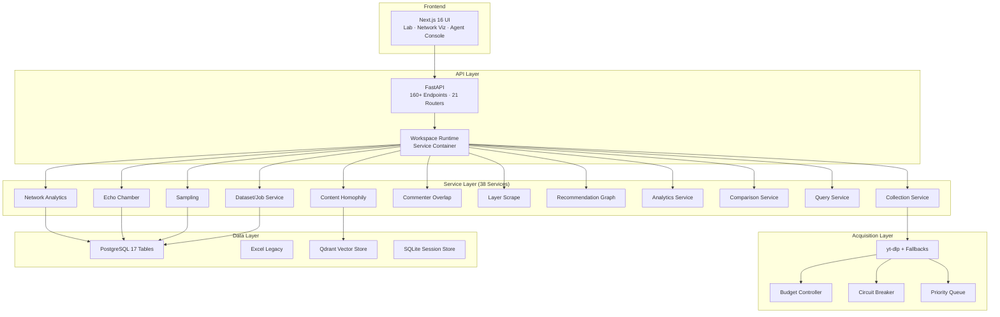
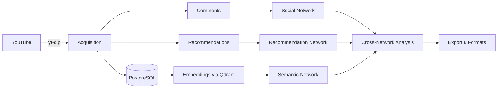
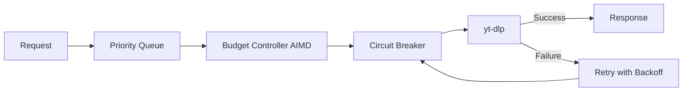

# Architecture

> Full system design, layered architecture, service container, and how the three systems connect.

---

## Three Systems, One Repository

| System | Entry Point | Purpose |
|---|---|---|
| **CSS Research Workbench** | `SocialScienceResearch/api/app.py` | YouTube data collection, network analysis, echo-chamber detection |
| **Graph-RAG Intelligence Agent** | `RetrievalPipeline/Graph/intelligence_graph.py` | Multi-stage intelligence analysis via LangGraph |
| **Ingestion Pipeline** | `Ingestion_Pipline/ingestion_service.py` | Document processing, embedding, vector storage |

---

## System Architecture



---

## CSS Research Workbench (`SocialScienceResearch/`)

### Layered Architecture

`SocialScienceResearch/` follows a clean layered architecture:

| Layer | Location | Responsibility |
|---|---|---|
| **Acquisition** | `acquisition/` | YouTube data extraction (yt-dlp, fallbacks, retry, normalization) |
| **Domain** | `domain/` | Entities, observations, enums, query system — no infrastructure dependencies |
| **Persistence** | `persistence/` | Dual backend: PostgreSQL repositories + Excel repositories |
| **Services** | `services/` | 38 analytical services (network, sampling, echo-chamber, etc.) |
| **API** | `api/` | FastAPI application, routers, schemas |
| **Concurrency** | `concurrency/` | Budget controller, circuit breaker, priority queue |
| **Config** | `config/` | Frozen dataclasses with environment variable loading |
| **UI** | `ui/` | Next.js 16 frontend |

### Service Container

`build_services()` at `app.py` constructs the service container and shares repositories across all services:

| Service | Responsibility |
|---|---|
| `collection_service` | Channel/video acquisition orchestration |
| `recommendations_service` | Recommendation observation workflow |
| `network_analytics_service` | Full NetworkX SNA, graph construction, export |
| `echo_chamber_service` | Echo-chamber detection with multi-layer crawl |
| `content_homophily_service` | Semantic similarity with permutation testing |
| `commenter_overlap_service` | Jaccard, overlap coefficient, bridge detection |
| `commenter_network_service` | Co-commenter network construction |
| `sampling_service` | 17 deterministic strategies with seed=42 |
| `layer_scrape_service` | BFS layered crawling with frontier management |
| `recommendation_graph_service` | Recommendation DiGraph with PageRank |
| `analytics_service` | Channel/video engagement analytics |
| `query_service` | Filtered corpus selection |
| `quality_service` | Dataset coverage reporting |
| `comparison_service` | Period/cohort/entity comparison |
| `longitudinal_service` | Longitudinal history tracking |

### Workspace Isolation

Each workspace gets:

- Its own PostgreSQL database (or Excel data directory)
- Independent service container
- Isolated collection runs, samples, and analyses
- Registry-based workspace management (`workspaces/registry.json`)

### API Layer

`create_app()` builds one FastAPI application with:

- **21 CSS routers** under `/api/v1/social-science/*`
- **Direct app routes** for collection, jobs, runs, channels, videos, sampling, analytics, export
- **The agent router** (conditional, mounted if graph imports)
- **160+ API paths** in `api/openapi.json`

### Middleware

- **Workspace routing** — syncs active workspace per request
- **CORS** — configurable origins
- **Exception handlers** — HTTPException, SamplingError, CursorError, ValueError, KeyError
- **Circuit breaker + priority queue** — resilience infrastructure

---

## Graph-RAG Intelligence Agent (`RetrievalPipeline/`)

### LangGraph State Machine

`intelligence_graph.py` compiles a LangGraph `StateGraph` with 5 nodes:

```
Identity Research → Profile Summarization → Subject Intelligence → Audience Intelligence → Ecosystem Intelligence → Compression
```

The `report_router` is a conditional edge that runs whichever report is missing, or returns `END`.

### Pipeline Nodes

| Node | Responsibility |
|---|---|
| Identity Research | Web search for identity anchors |
| Subject Intelligence | 6-layer analysis (entity, values, ideology, worldview, communications, synthesis) |
| Audience Intelligence | 9-layer analysis (profile, motivation, community, behavioral impact, etc.) |
| Ecosystem Intelligence | 6-layer analysis (macro-environment, institutional power, systemic risk, etc.) |
| Compression | Structured output (CompressedIntelligence model) |

### Persistence

- SQLite session store for resumable runs
- MemorySaver checkpointer for LangGraph state
- File-based report persistence

### Serving

Served over HTTP by `agent_server.py` with CopilotKit integration and SSE streaming.

---

## Ingestion Pipeline (`Ingestion_Pipline/`)

### Pipeline Stages

```
URL → Tavily Extract → Chunk (RecursiveCharacterTextSplitter) → Embed (Gemini) → Store (Qdrant)
```

### Components

| Component | Responsibility |
|---|---|
| `ingestion_service.py` | Facade orchestrating the pipeline |
| `ingestion/chunking.py` | Text splitting with tiktoken token counting |
| `ingestion/embedding_pipeline.py` | ResilientEmbeddingPipeline with batch processing |
| `ingestion/tavily_client.py` | Tavily crawl/extract/map builders |
| `infra/rate_limiter.py` | Token and request rate limiters |
| `infra/vector_store.py` | Qdrant collection and document operations |
| `config/settings.py` | Frozen dataclasses for all configuration |

### Rate Limiting

- **Token rate limiter** — async + sync throttle for worker threads
- **Request rate limiter** — RPM cap for API calls
- **Retry logic** — exponential backoff on failures

---

## Concurrency Infrastructure

| Component | File | Purpose |
|---|---|---|
| **Budget Controller** | `concurrency/budget_controller.py` | AIMD rate control for YouTube requests |
| **Circuit Breaker** | `concurrency/circuit_breaker.py` | Three-state health tracking per session/proxy |
| **Priority Queue** | `concurrency/priority_queue.py` | Priority-weighted task scheduling |
| **Semaphore** | `concurrency/ytdlp_semaphore.py` | Process-global YouTubeDL semaphore |

---

## Data Layer

### PostgreSQL Schema (17 tables)

| Table | Purpose |
|---|---|
| `channels` | Channel metadata |
| `videos` | Video metadata |
| `comments` | Comment data |
| `recommendations` | Directed recommendation edges |
| `transcripts` | Video transcripts |
| `collection_runs` | Run metadata with provenance |
| `collection_errors` | Failed collection attempts |
| `datasets` | Dataset definitions |
| `dataset_members` | Dataset video/comment associations |
| `samples` | Persisted samples with recipes |
| `sample_members` | Sample video/comment associations |
| `projects` | Research projects |
| `project_items` | Project artifacts |
| `layer_runs` | Layer crawl anchors |
| `echo_detections` | Echo-chamber detection results |
| `collection_jobs` | Job definitions |
| `author_profiles` | Aggregated author profiles |

### Excel Backend (Legacy)

Excel-based persistence with overflow sidecar files for research-friendly export. Same repository interface as PostgreSQL.

### Qdrant Vector Store

Embeddings for semantic search and content homophily analysis.

---

## Data Flow



---

## Resilience Architecture



---

## Testing

- **80+ test modules** across the repository
- **API contract tests** — OpenAPI snapshot guard
- **Centrality benchmark** — validated against Zachary's Karate Club
- **Service unit tests** — network, sampling, echo-chamber, comparison
- **Integration tests** — workspace, expansion, echo-chamber APIs
- **Playwright e2e** — frontend integration tests

---

- [Overview](index.md) · [Quickstart](quickstart.md) · [API Reference](api-reference.md)
