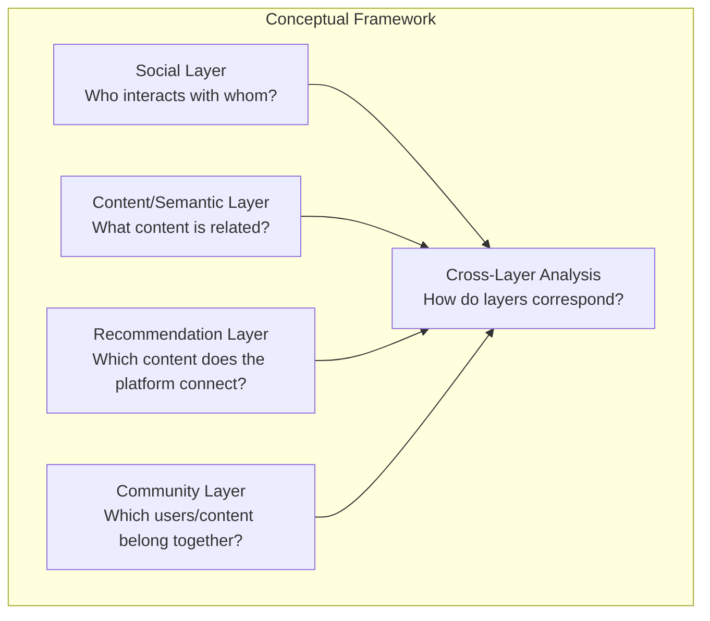
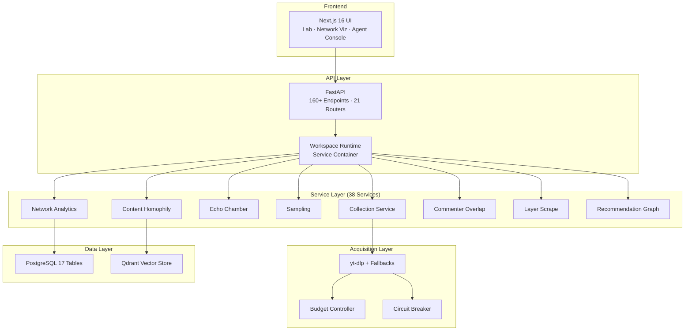
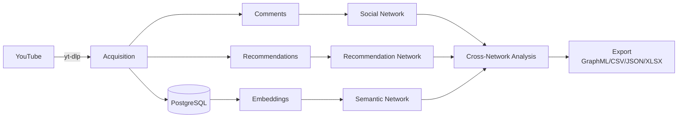
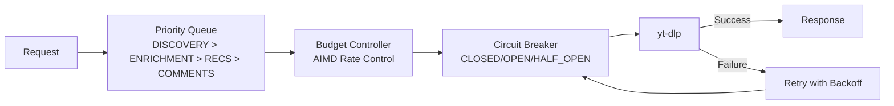

# Architecture — Conceptual Framework & System Design

---

## Conceptual Framework

The project operates through multiple interacting analytical layers, each capturing a different dimension of the YouTube information environment:

### Social Layer

**Question:** Who interacts with whom?

User interaction is represented through co-commenting patterns. When multiple users comment on the same video, they form an indirect interaction tie. This creates a commenter co-comment network where edges represent shared participation in comment sections.

**Metrics:** Jaccard similarity, overlap coefficient, bridge-commenter detection, co-commenter network projections.

### Content/Semantic Layer

**Question:** What content is related to what?

Content relationships are derived from transcript embeddings. Video transcripts are converted to vector representations, and semantic similarity between videos is computed through cosine similarity. This reveals content communities independent of social or recommendation structure.

**Metrics:** Cosine similarity, within/between-community pair sampling, permutation null testing, z-score and p-value.

### Recommendation Layer

**Question:** Which content does the platform connect?

Recommendation relationships are observed through systematic collection of "Up Next" and related video recommendations. These create directed edges between videos, forming a recommendation network with explicit direction and rank.

**Metrics:** PageRank, ego-networks, frontier collapse, cross-layer repetition, component analysis.

### Community Layer

**Question:** Which users/content belong to coherent communities?

Communities are detected through Louvain algorithm (seed=42) on each network type. Community structure is analyzed through modularity, conductance, within-community rate, and community persistence across layers.

### Cross-Layer Analysis

**Question:** How do social, semantic, and recommendation structures correspond or diverge?

Cross-layer analysis compares communities and structures across the three network types, identifying overlap, divergence, bridges, and isolated communities.

---

## System Architecture

### Three Cooperating Systems

| System | Entry Point | Purpose |
|---|---|---|
| **CSS Research Workbench** | `SocialScienceResearch/api/app.py` | YouTube data collection, network analysis, echo-chamber detection |
| **Graph-RAG Intelligence Agent** | `RetrievalPipeline/Graph/intelligence_graph.py` | Multi-stage intelligence analysis via LangGraph |
| **Ingestion Pipeline** | `Ingestion_Pipline/ingestion_service.py` | Document processing, embedding, vector storage |

### Data Flow

---

## Resilience Architecture

The resilience infrastructure ensures that large-scale data collection is operationally tractable while preserving data provenance and quality.
