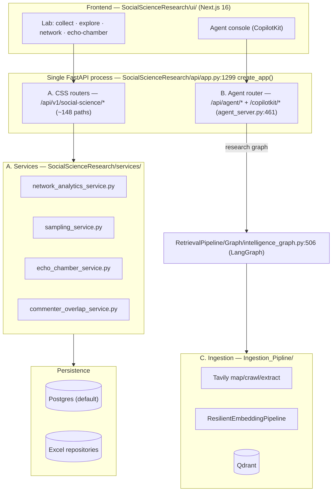

# Architecture

> One diagram, one page. The whole system is **three cooperating codebases in one repository**, serving 160 API paths through a single FastAPI process.

## The big picture



## How the three systems connect

1. **A (CSS Workbench)** is the primary producer. `yt-dlp` acquisition writes observations to Postgres/Excel; services (`network_analytics_service.py`, `sampling_service.py`, `echo_chamber_service.py`, ...) analyze them; routers expose them as **~148** endpoints under `/api/v1/social-science/*`.

2. **B (Graph-RAG Agent)** reuses the same FastAPI process. `RetrievalPipeline/agent_server.py:461` defines an `agent_router` that is conditionally mounted inside `create_app()` (guarded try/except at `app.py:1819`). It exposes:
   - `POST /copilotkit/agent/research_agent/connect` (agentic web UI),
   - `/api/agent/run`, `/api/agent/runs/{id}`, `/api/agent/logs` (SSE), `/api/agent/env`, `/api/agent/ai-config`,
   - `GET /health` (liveness).

3. **C (Ingestion Pipeline)** is a library (no HTTP): Tavily → chunk → `ResilientEmbeddingPipeline` → Qdrant, used by the agent research nodes.

## The Graph-RAG state machine (B)

Compiled from a LangGraph `StateGraph` in `RetrievalPipeline/Graph/intelligence_graph.py:506`:

```mermaid
stateDiagram-v2
    [*] --> identity_research
    identity_research --> profile_summarization
    profile_summarization --> report_router
    state report_router {
        subject_intelligence --> report_router
        audience_intelligence --> report_router
        ecosystem_intelligence --> report_router
    }
    report_router --> [*]
```

- **5 nodes** added via `workflow.add_node` (`intelligence_graph.py:561-565`).
- A conditional edge (`report_router`, `:92`) routes to whichever report (subject/audience/ecosystem) is still missing, or `END` when done.
- Each node runs on `profile_summarization` output and produces a report persisted to state and disk.

## Data model in one glance

- **Entities** (`domain/models.py`): `Channel`, `Video`, `Comment`, `CollectionRun`, `Sample`.
- **Observations** carry time-varying stats with `raw_json` and cross-reference a `collection_run_id` — analytics never mutate source rows.
- **Availability** is explicit: `available | missing | unsupported` (`domain/enums.py:137`).
- **Identity**: commenters resolved `author_id`-first with `author_name` fallback (`services/commenter_overlap_service.py`).

## Where to learn more

- [Case study](case-study.md) — end-to-end story.
- [Developers → Architecture](../for-developers/architecture.md) — the full layer breakdown and services table.
- [Developers → Ingestion & Agent](../for-developers/ingestion-and-agent.md) — how B and C actually run.
