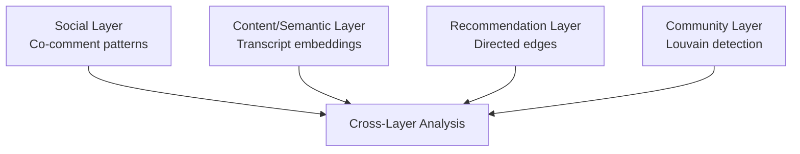

# For Researchers — 15-Minute Overview

> Methodology, reproducibility, network science, echo-chamber signals, and ethical considerations.

---

## Why This Project Exists

Contemporary platforms simultaneously function as social environments, content-distribution systems, recommendation engines, and information landscapes. Studying how these mechanisms interact requires computational infrastructure capable of representing and comparing multiple analytical perspectives on the same information ecosystem.

This project implements such infrastructure. It provides a computational social-science research workbench for constructing, analyzing, and comparing three network representations of YouTube data.

---

## The Five Things a Reviewer Checks

| Check | What This Project Delivers |
|---|---|
| **Observed, never estimated** | Every observation carries `available \| missing \| unsupported` status. Missing data is never zeroed or imputed. |
| **Reproducible** | Deterministic seeds (`seed=42`) across sampling, Louvain community detection, and permutation testing. |
| **Correct network measures** | Full SNA battery validated against Zachary's Karate Club (centrality matches NetworkX to 1e-6). |
| **Honest echo-chamber signals** | Five observable signals (S1-S5) with per-signal status indicators and composite scoring. No causal claims. |
| **Ethical data minimization** | Explicit ceilings, throttling, identity minimization (id-first, never fabricated), provenance tracking. |

---

## Research Motivation

The methodological gap: studying platform-mediated information environments through only one network can obscure important relationships.

| Network | Reveals | Cannot By Itself Reveal |
|---|---|---|
| Social network | Who interacts with whom | What content is discussed |
| Semantic network | Which content is related | Who interacts around it |
| Recommendation network | What YouTube connects | Whether users consume it |

The project integrates these perspectives within a single computational environment.

---

## Conceptual Framework

Each layer captures a different facet of the YouTube information environment. Cross-layer analysis examines how these facets correspond or diverge.

---

## Research Methodology

### Social Network Construction

Co-comment patterns create an indirect social network. Two commenters are connected if they comment on the same video. Edge weight uses Jaccard similarity or overlap coefficient.

### Semantic Content Analysis

Transcripts → embeddings → cosine similarity → within/between-community comparison → permutation null test.

### Recommendation Network Collection

Three-layer fallback extraction (yt-dlp → yt-search-python → page-dump parser) creates directed edges. BFS layered crawling expands the network across successive recommendation layers.

### Echo-Chamber Detection

Five observable signals computed from observed edges:

| Signal | What It Measures |
|---|---|
| S1: Frontier collapse ratio | Whether recommendation expansion narrows over layers |
| S2: Seed-community concentration | Whether recommendations cluster around the seed community |
| S3: Top-channel share | Concentration of recommendation edges in few channels |
| S4: Cross-layer repetition | Whether the same channels persist across layers |
| S5: Commenter-overlap reinforcement | Whether commenters within recommendations are from the same community |

Each signal is wrapped with `status: available | unavailable`. The composite score uses weights: s1=0.35, s2=0.30, s3=0.20, s4=0.15, s5=0.15.

### Content Homophily

Within/between-community pair sampling + embedding cosine similarity + permutation null test → z-score and p-value.

---

## Reproducibility

| Factor | Implementation |
|---|---|
| Sampling seed | `seed=42` (configurable via `SOCIAL_SAMPLING_SEED`) |
| Louvain seed | `seed=42` |
| Permutation test seed | Seeded RNG with `seed=42` |
| Null model | `COMMUNITY_SEED = 42`, `DEFAULT_N_RANDOMIZATIONS = 10` |
| Provenance | `collection_run_id` on every observation |
| Data availability | `available \| missing \| unsupported` on every field |
| Weight specs | Encoded `edge_type:weight_mode[:param]` grammar |
| API contract | CI-guarded OpenAPI specification |

To reproduce any analysis: same seed + same parameters + same data = same results.

---

## Network Science

Two network families with a formal weight grammar:

### Recommendation Network

Directed graph of observable YouTube recommendations. Expanded through BFS layered crawling with frontier management and snapshot classification.

### Audience/Commenter Network

Co-comment graph with multiple projections (video, channel, heterogeneous). Metrics include Jaccard, overlap coefficient, and bridge-commenter detection.

### Centrality Battery

10 measures: degree, closeness, eigenvector, betweenness, PageRank, harmonic, constraint, effective_size, bridging, clustering.

### Community Detection

Louvain algorithm (seed=42) with modularity, per-community conductance, within-community rate, and null-model comparison.

---

## Echo Chambers

### The Critical Distinctions

- **Community ≠ Echo Chamber** — structural cohesion is not evidence of information isolation
- **Similarity ≠ Polarization** — topical similarity is not ideological distance
- **Recommendation ≠ Causal Influence** — observed edges are not evidence of user behavior
- **Network Separation ≠ Psychological Isolation** — structural separation is not attitudinal isolation

### What the System Observes

Five structural signals computed from observed recommendation and interaction data. These are observable proxies, not proof of echo chambers.

---

## Ethics and Data Minimization

- **What is collected:** channel metadata, video metadata, comments (limited), recommendations, transcripts (opt-in)
- **What is not collected:** private messages, viewing history, personal data, authentication tokens
- **Default ceilings:** configurable via environment variables
- **Identity minimization:** author_id first, author_name fallback; never fabricated
- **Retention:** data persists as long as the workspace exists; deletion is workspace-scoped

---

## Pages in This Section

| Page | Content |
|---|---|
| [Methodology](methodology.md) | Observations, data availability, determinism |
| [Reproducibility](reproducibility.md) | Seeds, provenance, weight specs, figure contract |
| [Network Science](network.md) | Two network families, centrality, communities, export |
| [Echo Chamber](echo-chamber.md) | S1-S5 signals, parameters, structural analysis |
| [Sampling](sampling.md) | 17 strategies, determinism, advanced filtering |
| [Ethics](ethics.md) | Data collection scope, minimization, retention |
| [Data Model](data-model.md) | Entities, observations, persistence |
| [Citation](citation.md) | How to cite the software and datasets |
