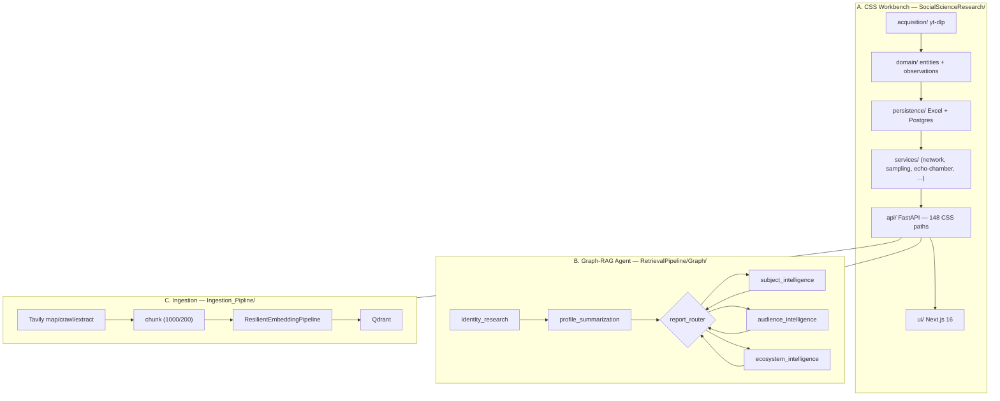

# Graph RAG Agent

> **Three systems, one repository, one research workflow.** A computational-social-science workbench that turns YouTube into analyzable network data, plus a Graph-RAG intelligence agent and a resilient RAG ingestion pipeline. Every claim on this site is grounded in **committed code** — each section cites the exact `file:line` where the behavior is implemented, and the API reference is generated from the contract that CI guards.

## Pick your track

| Track | Time | You are |
|---|---|---|
| [**For Recruiters**](for-recruiters/index.md) | 2 min | Hiring manager · team lead — what it does, why it matters, your impact |
| [**For Researchers**](for-researchers/index.md) | 15 min | Reviewer deciding on rigor — methodology, reproducibility, network science, ethics |
| [**For Developers**](for-developers/quickstart.md) | 5 min to run | Engineer or business user who wants to run, extend, or integrate it |

---

## What this repository is

A single codebase containing **three cooperating systems**:

<div class="grid cards" markdown>

- :material-math-compass: **A. CSS Research Workbench** — `SocialScienceResearch/`

    ---

    YouTube **collect → observe → sample → analyze → network → export** pipeline. FastAPI backend with **160 documented API paths**, Postgres/Excel persistence, pluggable data availability (`available | missing | unsupported`), deterministic sampling and Louvain community detection.

    Entry point: `SocialScienceResearch/api/app.py:1299 create_app()`

- :material-account-group: **B. Graph-RAG Intelligence Agent** — `RetrievalPipeline/`

    ---

    A LangGraph state machine that runs **Identity → Profile → Subject/Audience/Ecosystem** intelligence research, exposed over `HTTP` ([/api/agent/*](for-developers/ingestion-and-agent.md)) and CopilotKit.

    Entry point: `RetrievalPipeline/Graph/intelligence_graph.py:506` `StateGraph`

- :material-database-arrow-down: **C. Ingestion Pipeline** — `Ingestion_Pipline/`

    ---

    A resilient Tavily-crawl → chunk → embed → Qdrant pipeline (`ResilientEmbeddingPipeline`) with token/request rate limiting and retry policies.

    Entry point: `Ingestion_Pipline/ingestion_service.py:162 EmbedDocumentsToVectoreDb()`

</div>



---

## What you get — the honest version

- **160 API paths**, one merged FastAPI app. `~148` under `/api/v1/social-science/*` (the CSS workbench), `11` agent endpoints (`/api/agent/*`, `/copilotkit/*`), plus `/health`. Source of truth: `SocialScienceResearch/api/openapi.json`, guarded by `SocialScienceResearch/tests/test_openapi_snapshot.py` (CI fails on drift).
- **Observed, never estimated.** Missing data is flagged `available | missing | unsupported` — never zeroed. Time-varying values live on per-run `*Observation` models that preserve the raw provider payload (`SocialScienceResearch/domain/models.py`).
- **Deterministic research.** Sampling seed `SOCIAL_SAMPLING_SEED=42`, Louvain `seed=42` for community detection, seeded permutation tests — reproducible figures (`SocialScienceResearch/services/network_analytics_service.py`).
- **Validated against a classic benchmark.** The centrality battery is checked against Zachary's Karate Club (34 nodes / 78 edges) and matches `networkx` reference values to `1e-6` (`SocialScienceResearch/tests/test_centrality_benchmark.py`).

!!! success "A word on provenance"
    Every contract fact here resolves to a real, committed file. When a doc says "see `network_analytics_service.py:976`", that line exists in the repository you just cloned — not in a planning document that was git-ignored.

---

## Canonical research journey

```
Select a research target
  → Collect data (provenance per run)
  → Understand the dataset (explorer + coverage)
  → Explore patterns (metrics + feasibility)
  → Sample data (deterministic, seed=42)
  → Build / compare networks (recommendation + audience)
  → Test differences (permutation / bootstrap)
  → Export / publish (GraphML, CSV, JSON, XLSX)
```

This journey is realized end-to-end by the CSS workbench routes — `POST /collect`, `GET /coverage`, `/videos`, `/sampling/advanced`, `/network/*`, `/network/test-difference`, `/export` — all present in `SocialScienceResearch/api/openapi.json`.

---

## Quick start (3 commands)

```bash
# 1. Postgres (auto-creates the social_science DB on first boot)
docker compose up -d

# 2. Backend — the same FastAPI serves the CSS workbench + the agent
uvicorn SocialScienceResearch.api:create_app --factory --host 0.0.0.0 --port 8000

# 3. Frontend
cd SocialScienceResearch/ui && npm run dev
```

Full runbook in [For Developers → Quickstart](for-developers/quickstart.md).

---

## Credits & honesty

- **API contract is law:** `SocialScienceResearch/CONTRACT.md` describes the drift gate. Docs never invent a path the code doesn't ship.
- **Performance claims** are traceable to tests, not invented wall-clock figures.
- License: MIT. Citation information in [For Researchers → Citation](for-researchers/citation.md).

---

## Continue

- Recruiter? → [For Recruiters (2 min)](for-recruiters/index.md)
- Scientist/reviewer? → [For Researchers (15 min)](for-researchers/index.md)
- Engineer? → [For Developers → Quickstart (5 min)](for-developers/quickstart.md)
- Need the full endpoint list? → [API Reference](for-developers/api-reference.md)
