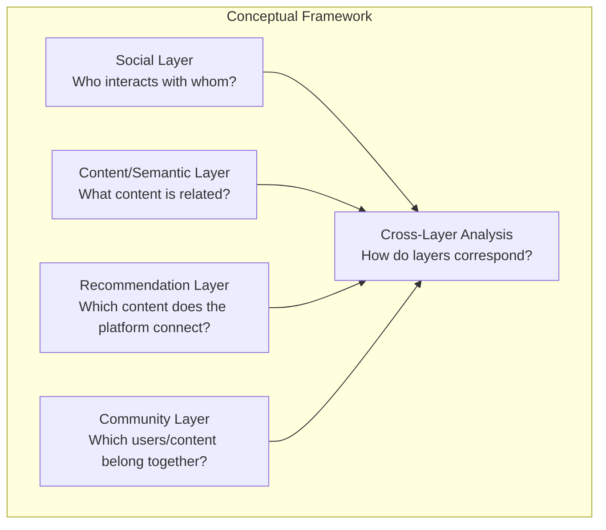
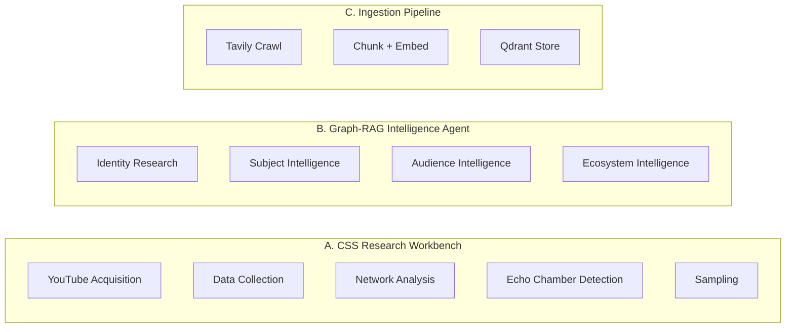
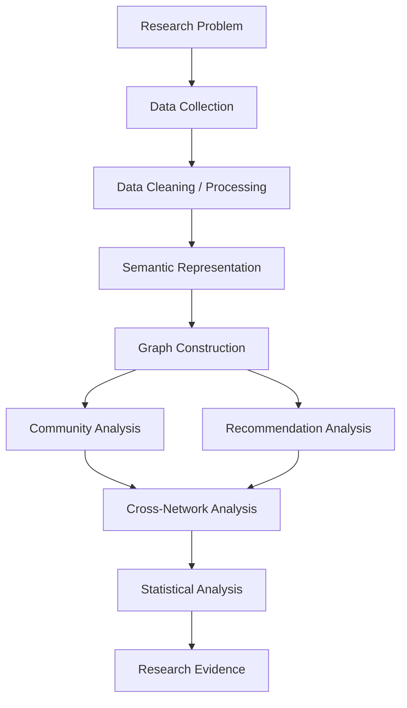

# Graph RAG Agent — Computational Social Science Research Platform

> A research-engineering artifact for investigating platform-mediated information environments through joint analysis of social interaction, content semantics, recommendation structures, and community dynamics on YouTube.

---

## Why This Project Exists

Contemporary platforms simultaneously function as social environments, content-distribution systems, recommendation engines, and information landscapes. Studying how these layered mechanisms shape user experience, community formation, and information access requires computational infrastructure capable of representing and comparing multiple analytical perspectives on the same information ecosystem.

This project implements such infrastructure. It provides a computational social-science research workbench that constructs and jointly examines three network representations of YouTube data: a social interaction network, a semantic content network, and a platform-mediated recommendation network.

---

## Problem Statement

Contemporary digital platforms are simultaneously social environments, content-distribution environments, recommendation environments, and information environments. Users do not experience these systems through a single mechanism. They encounter social interactions, content, content communities, algorithmic recommendations, repeated or diversified exposure, and community boundaries as interleaved forces.

These mechanisms interact in ways that are difficult to study using a single dataset or network representation. A researcher examining only social interactions may miss how recommendation pathways connect otherwise separate communities. A researcher examining only recommendation structures may miss how content semantics cluster differently from platform-mediated connections.

---

## Research Challenge

Each individual network representation captures only a partial view:

| Network Type | Reveals | Cannot By Itself Reveal |
|---|---|---|
| Social network | Who interacts with whom | What content is being discussed |
| Semantic/content network | Which content is related | Who is interacting around that content |
| Recommendation network | Which videos the platform connects | Whether users consume those recommendations |

Therefore, investigating platform-mediated information environments requires integrating multiple representations of the same ecosystem.

---

## Conceptual Framework

The project operates through multiple interacting analytical layers:



- **Social Layer** — User interaction through co-commenting patterns
- **Content/Semantic Layer** — Content relationships through transcript embeddings
- **Recommendation Layer** — Platform-mediated content connections
- **Community Layer** — Groups emerging from structural or semantic relationships
- **Cross-Layer Relationships** — How these structures correspond or diverge

---

## Three Systems, One Repository



| System | Purpose | Key Metrics |
|---|---|---|
| **CSS Research Workbench** | YouTube data collection, network analysis, echo-chamber detection | 160+ API endpoints, 38 services |
| **Graph-RAG Intelligence Agent** | Multi-stage intelligence analysis via LangGraph | 5-node pipeline, session persistence |
| **Ingestion Pipeline** | Document processing and vector storage | Tavily crawl, Qdrant embeddings |

---

## End-to-End Research Pipeline



---

## Quick Start

```bash
# 1. Start PostgreSQL
docker compose up -d

# 2. Start backend
uvicorn SocialScienceResearch.api:create_app --factory --host 0.0.0.0 --port 8000

# 3. Start frontend
cd SocialScienceResearch/ui && npm install && npm run dev
```

---

## Choose Your Track

| Track | Time | What You Get |
|---|---|---|
| [**For Recruiters**](for-recruiters/index.md) | 2 min | What was built, technical complexity, achievements |
| [**For Researchers**](for-researchers/index.md) | 15 min | Methodology, reproducibility, network science, echo chambers |
| [**For Developers**](for-developers/quickstart.md) | 5 min | Setup, architecture, API reference |

---

## Honesty Principles

- **Observed, never estimated.** Missing data is `available | missing | unsupported`, never zeroed.
- **Deterministic.** Sampling and community detection use `seed=42`; permutation tests are seeded and reproducible.
- **Validated.** The centrality battery matches NetworkX on Zachary's Karate Club to 1e-6.
- **Contract is law.** The OpenAPI specification is generated and CI-guarded; docs never invent a path.

---

## Citation

See [Researchers → Citation](for-researchers/citation.md). `CITATION.cff` at repo root.

## License

MIT.
